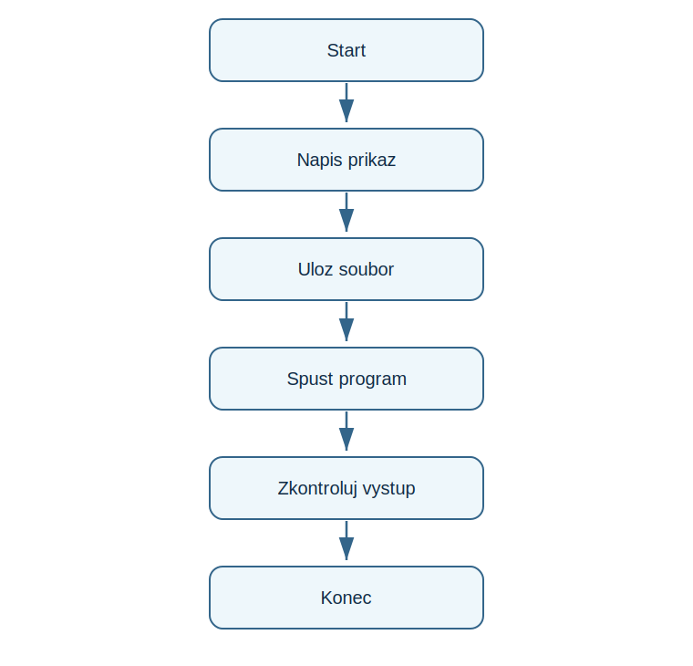

# Lekce 1 - Vyvojove prostředí

<div class="lesson-meta">
<strong>Doporučený čas:</strong> 45 minut<br>
<strong>Výstup lekce:</strong> Student vytvoří soubor s prvním příkazem, spustí ho a pozna vystup v konzoli.<br>
<strong>Zdrojová předloha:</strong> Python-first steps-p.51, uvod do prace s editorem a uložením souboru
</div>

## Co se dnes naučíš

- spustit Python nebo skolni editor
- vytvořít novy soubor s priponou .py
- uložit program pred spustenim
- poznat rozdil mezi editorem a vystupnim oknem

## Proč to potřebujeme

Na zacatku je dulezite videt cely cyklus prace: napsat příkaz, uložit soubor, spustit program a podivat se na vysledek. PDF vede studenta nejprve pres prostředí, ne pres teorii jazyka.

!!! info "Důležitá myšlenka"
    Program je posloupnost příkazů. Python je cte shora dolu a vysledek ukazuje v konzoli nebo v okne editoru.

## Analýza problému

- vstup neni potreba
- program obsahuje jeden příkaz print()
- výstupem je kratka zprava v konzoli
- důležitý krok je uložení souboru pred spustenim

## Schéma průběhu

{ .flowchart }

## Ukázkový program

```python title="code/hello.py" linenums="1"
print("Python funguje.")
```

[Stáhnout soubor `hello.py`](code/hello.py){ .md-button .md-button--primary }

## Rozbor programu

| Část programu | Význam |
| --- | --- |
| `print(...)` | zobrazi text nebo hodnotu |
| `"Python funguje."` | řetězec, ktery se ma vypsat |
| uložení souboru | zaruci, ze se spustí aktuální verze programu |

## Zkus změnit

- Změň text uvnitr uvozovek a spust program znovu.
- Zkus program spustit bez uložení a sleduj, co se stane v tvem editoru.
- Pridavej další radky s print() a porovnej pořadí výstupu.

## Časté chyby

!!! warning "Častá chyba: Soubor se nespustíl v nove verzi"
    **Proč vznikne:** Program nebyl po uprave ulozen.

    **Oprava:** Pred spustenim použij Save nebo klavesovou zkratku editoru.

!!! warning "Častá chyba: Python hlasi chybu u textu"
    **Proč vznikne:** Chybi jedna uvozovka.

    **Oprava:** Doplň stejne uvozovky na začátek i konec textu.

## Tahák

| Zápis | K čemu slouží |
| --- | --- |
| `.py` | pripona souboru s programem v Pythonu |
| Run | spusteni programu |
| konzole | místo, kde se objevi textovy vystup |

## Co už umím

- [ ] umím vytvořít novy soubor programu
- [ ] umím program uložit
- [ ] umím program spustit
- [ ] umím najít vystup programu

## Shrnutí

!!! success "Zapamatuj si"
    Lekce zavedla zakladni pracovni rytmus. Nejde jeste o mnoho příkazů, ale o jistotu, ze student vi, kde pise kód a kde vidi vysledek.
