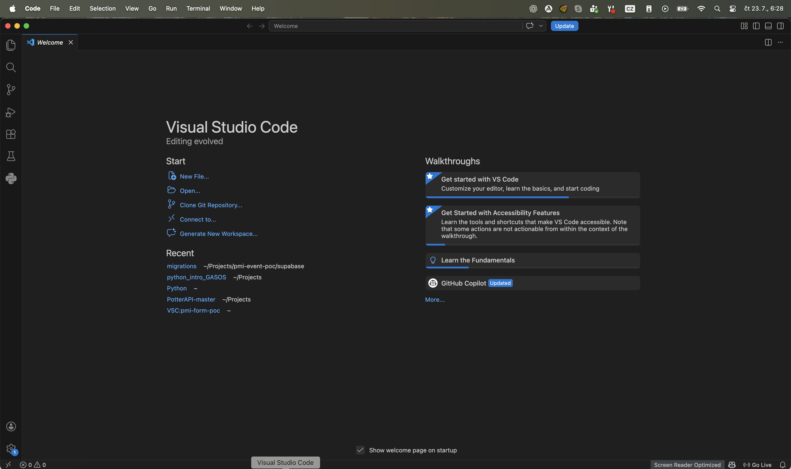
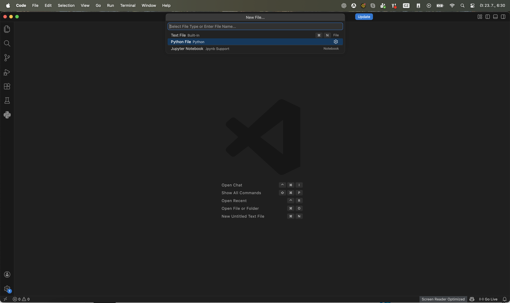
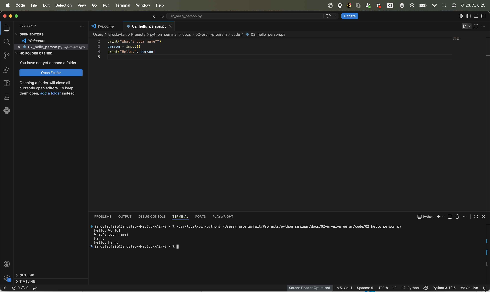

# Lekce 1 - Vývojové prostředí

<div class="lesson-meta">
<strong>Doporučený čas:</strong> 45 minut<br>
<strong>Výstup lekce:</strong> Student se zorientuje ve VS Code, vytvoří nový Python soubor a spustí první program v terminálu.
</div>

## Co se dnes naučíš

- poznat základní části editoru VS Code
- vytvořit nový soubor typu Python
- uložit soubor s příponou `.py`
- spustit program tlačítkem Run
- najít výsledek programu v terminálu
- rozpoznat základní barevné zvýraznění kódu

## Proč používáme VS Code

VS Code je editor, ve kterém budeme psát programy. Není to samotný Python, ale prostředí, které nám pomáhá psát kód přehledněji, spouštět programy a číst chyby.

!!! info "Důležitá myšlenka"
    Program píšeš v editoru, ale výsledek běhu programu uvidíš v terminálu.

## 1. Úvodní obrazovka



Po spuštění VS Code se zobrazí úvodní obrazovka. Z ní můžeš otevřít složku, vytvořit nový soubor nebo se vrátit k nedávným projektům.

## 2. Vytvoření Python souboru



Nový program vytvoříš jako **Python File**. Soubor musí mít příponu `.py`, například:

```text
hello.py
```

!!! tip "Přípona .py"
    Přípona `.py` říká editoru i počítači, že jde o soubor s programem v Pythonu.

## 3. Základní pracovní prostředí



Na obrázku vidíš základní části prostředí:

| Část | K čemu slouží |
| --- | --- |
| Explorer | zobrazuje soubory a složky projektu |
| Editor kódu | místo, kde píšeš program |
| Záložka souboru | ukazuje, který soubor právě upravuješ |
| Tlačítko Run | spustí aktuální Python soubor |
| Terminál | zobrazí výstup programu a případné chyby |
| Stavový řádek | ukazuje informace o souboru a použité verzi Pythonu |

## 4. První spuštění programu

V editoru může být například tento program:

```python title="code/hello.py" linenums="1"
print("Hello, World!")
print("What's your name?")
person = input()
print("Hello,", person)
```

## Rozbor programu

| Část programu | Význam |
| --- | --- |
| `print("Hello, World!")` | vypíše první pozdrav |
| `print("What's your name?")` | zobrazí otázku |
| `person = input()` | počká na vstup uživatele a uloží ho do proměnné `person` |
| `print("Hello,", person)` | vypíše pozdrav doplněný o zadané jméno |

Po spuštění se výsledek objeví dole v terminálu. Program nejdřív vypíše pozdrav, potom se zeptá na jméno a nakonec použije odpověď v dalším výpisu.

## 5. Proč má kód různé barvy

VS Code obarvuje části kódu, aby se v něm lépe četlo. Tomu se říká zvýraznění syntaxe. Barvy se můžou lišit podle nastaveného motivu, ale ve výchozím tmavém režimu často uvidíš podobné rozlišení:

| Část kódu | Příklad | Typická barva ve VS Code Dark Mode | Co barva napovídá |
| --- | --- | --- | --- |
| funkce | `print`, `input` | žlutá | Python zde volá hotovou funkci |
| textový řetězec | `"Hello, World!"` | oranžová až hnědooranžová | jde o přesný text v uvozovkách |
| proměnná | `person` | světle modrá | jméno hodnoty uložené v programu |
| operátor | `=` | světlá / šedá | provádí přiřazení nebo jinou operaci |
| závorky a čárky | `(`, `)`, `,` | světlá / šedá | určují strukturu příkazu |
| čísla řádků | `1`, `2`, `3` | šedá | pomáhají orientaci v souboru |

## Zkus změnit

- Změň text `Hello, World!` a program znovu spusť.
- Zadej při spuštění jiné jméno a sleduj výsledek v terminálu.
- Přidej další řádek s `print()`.

## Časté chyby

!!! warning "Častá chyba: Program se spustí ve staré verzi"
    **Proč vznikne:** Soubor nebyl po úpravě uložený.

    **Oprava:** Před spuštěním soubor ulož.

!!! warning "Častá chyba: Výstup hledám v editoru"
    **Proč vznikne:** Kód se píše v editoru, ale program běží v terminálu.

    **Oprava:** Po spuštění se podívej do spodní části VS Code na panel Terminal.

## Co už umím

- [ ] poznám editor, explorer a terminál
- [ ] umím vytvořit Python soubor
- [ ] vím, proč má soubor příponu `.py`
- [ ] umím spustit program tlačítkem Run
- [ ] najdu výstup programu v terminálu
- [ ] chápu, že barvy v editoru pomáhají číst kód

## Shrnutí

!!! success "Zapamatuj si"
    VS Code je pracovní stůl programátora. V editoru píšeš kód, přes Run ho spustíš a v terminálu zkontroluješ výsledek. Barevné zvýraznění ti pomáhá poznat funkce, texty, proměnné a další části programu.
