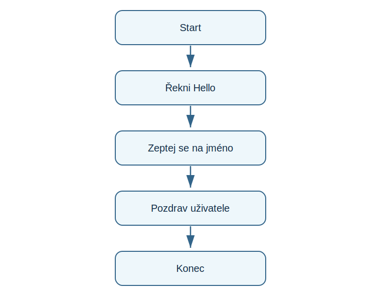

# Lekce 2 - První program

<div class="lesson-meta">
<strong>Doporučený čas:</strong> 45-60 minut<br>
<strong>Výstup lekce:</strong> Student napíše zprávu pomocí print(), přidá více řádků a rozumí pořadí příkazů.<br>
<strong>Zdrojová předloha:</strong> Python-first steps-p.51, část Your first program
</div>

## Co se dnes naučíš

- použít příkaz print()
- zapsat text jako řetězec
- spustit více příkazů za sebou
- poznat komentář v programu

## Proč to potřebujeme

První program má být malý a úspěšný. PDF pracuje s pozdravem, uložením souboru a postupným přidáváním dalších řádků.

!!! info "Důležitá myšlenka"
    Python vykoná první řádek, potom druhý řádek a tak dál. Pořadí příkazů je proto součást algoritmu.

## Analýza problému

- program nic nenačítá od uživatele
- každý řádek print() vytvoří jeden řádek výstupu
- komentář slouží člověku, Python ho nevykoná

## Schéma průběhu

{ .flowchart }

## Ukázkový program

```python title="code/prvni_program.py" linenums="1"
# Prvni program
print("Ahoj, svete!")
print("Ucim se Python.")
```

[Stáhnout soubor `prvni_program.py`](code/prvni_program.py){ .md-button .md-button--primary }

## Rozbor programu

| Část programu | Význam |
| --- | --- |
| `# První program` | komentář pro čtenáře kódu |
| `print("Ahoj, svete!")` | vypíše první zprávu |
| druhý `print()` | ukazuje, ze příkazy bezi v pořadí shora dolu |

## Zkus změnit

- Přehoď oba radky print() a sleduj změnu výstupu.
- Odstran jednu závorku a přečti si chybovou hlášku.
- Doplň třetí řádek, ktery napíše tvoje jméno.

## Časté chyby

!!! warning "Častá chyba: `Print()` místo `print()`"
    **Proč vznikne:** Python rozlisuje malá a velká písmena.

    **Oprava:** Použij přesně `print` malými písmeny.

!!! warning "Častá chyba: Text neni v uvozovkach"
    **Proč vznikne:** Python se snaží text chápat jako název.

    **Oprava:** Uzavři text do uvozovek.

## Tahák

| Zápis | K čemu slouží |
| --- | --- |
| `print("text")` | vypíše text |
| `# komentář` | poznámka v kódu |
| pořadí řádků | pořadí vykonáni programu |

## Co už umím

- [ ] umím vypsat text
- [ ] umím přidat více výstupu
- [ ] rozumím komentáři
- [ ] umím opravit chybějící uvozovky nebo závorku

## Shrnutí

!!! success "Zapamatuj si"
    První program ukázal, ze i krátký kód má strukturu: příkaz, data v uvozovkach a pořadí řádků.
