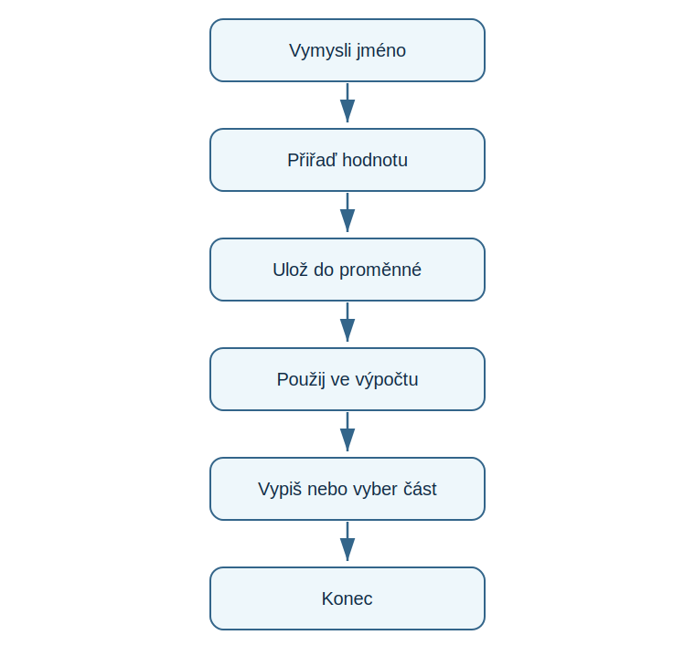

# Lekce 3 - Proměnné

<div class="lesson-meta">
<strong>Doporučený čas:</strong> 60-75 minut<br>
<strong>Výstup lekce:</strong> Student vytvoří proměnnou, uloží do ní číslo, řetězec nebo seznam a použije uloženou hodnotu v programu.<br>
<strong>Zdrojová předloha:</strong> Python-first steps-p.51, strany 24-27, kapitola Variables
</div>

## Co se dnes naučíš

- vytvořit proměnnou a přiřadit jí hodnotu
- vypsat hodnotu proměnné pomocí `print()`
- pojmenovat proměnnou tak, aby se dala dobře číst
- použít proměnné pro jednoduché výpočty
- uložit text do řetězce a spojit dva řetězce dohromady
- uložit více hodnot do seznamu a vybrat položku podle pozice

## Proč to potřebujeme

Když chceš psát užitečný kód, potřebuješ si v programu ukládat části informací a dát jim štítky. Právě to dělají proměnné. Hodí se třeba pro uložení skóre ve hře, pro výsledek výpočtu nebo pro seznam věcí.

!!! info "Proměnná jako úložný box"
    Proměnnou si představ jako krabičku se jménem. Do krabičky uložíš data, později je podle jména znovu najdeš a můžeš je změnit.

!!! info "Důležitá myšlenka"
    Proměnná potřebuje jméno. Za jméno napíšeš rovnítko a za něj hodnotu, kterou chceš do proměnné uložit.

## Jak vytvořit proměnnou

Nejprve vytvoříme proměnnou `age`. Její hodnota bude `12`. Potom proměnnou vypíšeme v shellu.

```python title="code/01_age.py" linenums="1"
age = 12
print(age)
```

| Část programu | Význam |
| --- | --- |
| `age` | jméno proměnné |
| `=` | přiřazení hodnoty do proměnné |
| `12` | hodnota uložená v proměnné |
| `print(age)` | vypíše hodnotu proměnné, ne slovo `age` |

!!! tip "Pozor na uvozovky"
    Když píšeš `print(age)`, Python použije hodnotu proměnné. Kdybys napsal `print("age")`, vypsal by přímo text `age`.

## Pojmenování proměnných

Dobré jméno proměnné ti později připomene, co je uvnitř. Když hráč ve hře žije, může se proměnná jmenovat třeba `player_lives`.

| Dělej | Nedělej |
| --- | --- |
| začínej jméno proměnné písmenem | nezačínej číslem |
| používej jasná slova | nepoužívej náhodné symboly |
| místo mezery použij podtržítko `_` | nepoužívej mezery |
| používej malá písmena | nemíchej zbytečně velká a malá písmena |
| vyhýbej se slovům, která Python používá jako příkazy | nepoužívej například `print` jako jméno proměnné |

## Čísla v proměnných

Proměnné mohou ukládat čísla a potom s nimi počítat. V Pythonu se celá čísla označují jako integers a desetinná čísla jako floats.

### Jednoduchý výpočet

```python title="code/02_numbers.py" linenums="1"
x = 6
y = 7
z = x * y
print(z)

x = 10
print(x)

x = 10
x = x * 7
print(x)
```

| Krok | Co se stane |
| --- | --- |
| `x = 6` | vytvoří se proměnná `x` a uloží se do ní číslo 6 |
| `y = 7` | vytvoří se proměnná `y` a uloží se do ní číslo 7 |
| `z = x * y` | Python vynásobí hodnoty `x` a `y` a výsledek uloží do `z` |
| `x = 10` | hodnota proměnné `x` se změní na 10 |
| `x = x * 7` | Python vezme starou hodnotu `x`, vynásobí ji 7 a výsledek uloží zpět do `x` |

!!! info "Znaménka pro výpočty"
    `+` sčítá, `-` odčítá, `*` násobí a `/` dělí.

## Práce s řetězci

Řetězec je libovolná posloupnost znaků: slovo, věta, jméno nebo zpráva. Každý znak napsaný na klávesnici může být uložený v řetězci. Řetězce vždy začínají a končí uvozovkami.

### Řetězec v proměnné

```python title="code/03_strings.py" linenums="1"
name = "Ally Alien"
print(name)

greeting = "Welcome to Earth, "
message = greeting + name
print(message)

print(len(message))
```

| Část programu | Význam |
| --- | --- |
| `name = "Ally Alien"` | uloží text do proměnné |
| `greeting + name` | spojí dva řetězce dohromady |
| `message` | uloží nově vzniklou zprávu |
| `len(message)` | spočítá, kolik znaků řetězec obsahuje |

!!! tip "Délka řetězce"
    `len()` je vestavěná funkce. Když ji zavoláš s řetězcem v závorce, Python spočítá počet znaků včetně mezer.

## Seznamy

Když potřebuješ uložit hodně dat nebo zachovat jejich pořadí, použiješ seznam. Seznam může obsahovat více položek najednou a Python umí položky vybrat podle jejich pozice.

### Mnoho proměnných

Kdyby hra měla jen tři hráče v týmu, šlo by vytvořit samostatnou proměnnou pro každého hráče.

```python
rockets_player_1 = "Rory"
rockets_player_2 = "Rav"
rockets_player_3 = "Rachel"
```

Když je hráčů víc, začne být takový zápis nepřehledný.

### Seznam v proměnné

```python title="code/04_lists.py" linenums="1"
rockets_player_1 = "Rory"
rockets_player_2 = "Rav"
rockets_player_3 = "Rachel"

planets_player_1 = "Peter"
planets_player_2 = "Pablo"
planets_player_3 = "Polly"

rockets_players = ["Rory", "Rav", "Rachel", "Renata", "Ryan", "Ruby"]
planets_players = ["Peter", "Pablo", "Polly", "Penny", "Paula", "Patrick"]

print(rockets_players[0])
print(planets_players[5])
```

| Část programu | Význam |
| --- | --- |
| `[ ... ]` | hranaté závorky označují seznam |
| čárky mezi položkami | oddělují jednotlivé hodnoty |
| `rockets_players[0]` | vybere první položku seznamu |
| `planets_players[5]` | vybere šestou položku seznamu |

!!! warning "Číslování v seznamech"
    Python začíná počítat pozice od nuly. První položka má pozici `0`, druhá pozici `1` a šestá pozici `5`.

## Schéma průběhu

{ .flowchart }

## Zkus změnit

- Změň hodnotu `age` a znovu ji vypiš.
- V příkladu s čísly změň hodnotu `x` nebo `y` a předem odhadni výsledek.
- Přidej další jméno do seznamu `rockets_players`.
- Zkus vybrat ze seznamu jinou pozici a řekni, proč Python používá právě toto číslo.

## Časté chyby

!!! warning "Častá chyba: Uvozovky kolem jména proměnné"
    **Proč vznikne:** `print("age")` vypíše přímo slovo `age`, protože je v uvozovkách.

    **Oprava:** Pokud chceš vypsat hodnotu proměnné, napiš `print(age)`.

!!! warning "Častá chyba: Mezera ve jménu proměnné"
    **Proč vznikne:** Python bere mezeru jako oddělovač, ne jako součást názvu.

    **Oprava:** Použij podtržítko, například `player_lives`.

!!! warning "Častá chyba: Špatná pozice v seznamu"
    **Proč vznikne:** První položka seznamu není na pozici `1`, ale na pozici `0`.

    **Oprava:** Při výběru položky počítej od nuly.

## Tahák

| Zápis | K čemu slouží |
| --- | --- |
| `age = 12` | uloží číslo do proměnné |
| `print(age)` | vypíše hodnotu proměnné |
| `x = x * 7` | aktualizuje hodnotu proměnné |
| `"Ally Alien"` | řetězec uložený v uvozovkách |
| `greeting + name` | spojení dvou řetězců |
| `len(message)` | počet znaků v řetězci |
| `players = ["Rory", "Rav"]` | seznam hodnot |
| `players[0]` | první položka seznamu |

## Co už umím

- [ ] umím vytvořit proměnnou a přiřadit jí hodnotu
- [ ] umím vypsat hodnotu proměnné bez uvozovek
- [ ] znám základní pravidla pojmenování proměnných
- [ ] umím použít proměnné ve výpočtu
- [ ] umím uložit a spojit řetězce
- [ ] umím vytvořit seznam a vybrat položku podle pozice

## Shrnutí

!!! success "Zapamatuj si"
    Proměnné ukládají hodnoty pod jménem. Hodnotou může být číslo, řetězec nebo seznam. Jakmile hodnotu uložíš, můžeš ji vypsat, použít ve výpočtu, změnit nebo z ní vybrat konkrétní část.
