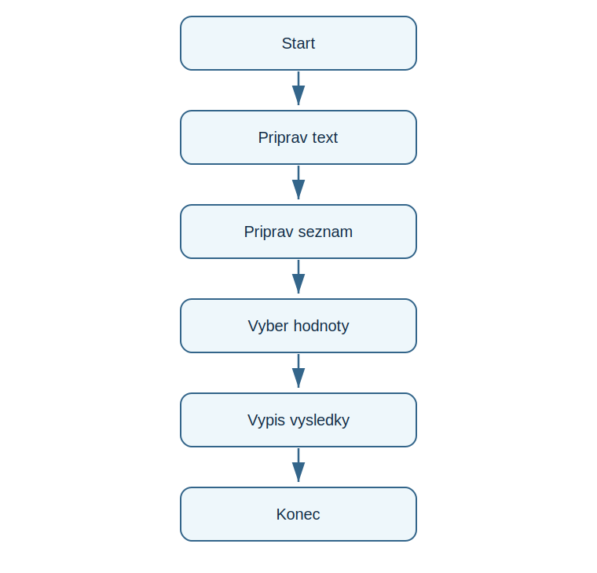

# Lekce 4 - Řetězce a seznamy

<div class="lesson-meta">
<strong>Doporučený čas:</strong> 60 minut<br>
<strong>Výstup lekce:</strong> Student rozumí textu jako retezci, seznamu hodnot a náhodněmu výběru prvku.<br>
<strong>Zdrojová předloha:</strong> Python-first steps-p.51, navaznost na praci s textem a vyberem hodnot
</div>

## Co se dnes naučíš

- zjistit délku textu pomocí len()
- vybrat znak nebo prvek podle indexu
- vytvořít seznam
- vybrat nahodnou polozku ze seznamu

## Proč to potřebujeme

Pro další projekty je potreba pracovat s více moznostmi: slovy, odpověďmi, predmety nebo barvami. Seznam je jednoduchy zpusob, jak je mit pohromade.

!!! info "Důležitá myšlenka"
    Retezec je řada znaků. Seznam je řada hodnot. V obou pripadech Python pocita pozice od nuly.

## Analýza problému

- program připraví text a seznam
- z textu zjisti délku a první znak
- ze seznamu vybere druhý prvek
- náhodně vybere jedno zvire

## Schéma průběhu

{ .flowchart }

## Ukázkový program

```python title="code/seznamy.py" linenums="1"
from random import choice

word = "python"
animals = ["pes", "kocka", "sova", "had"]

print(len(word))
print(word[0])
print(animals[1])
print(choice(animals))
```

[Stáhnout soubor `seznamy.py`](code/seznamy.py){ .md-button .md-button--primary }

## Rozbor programu

| Část programu | Význam |
| --- | --- |
| `word[0]` | první znak, protoze indexovani začíná nulou |
| `animals[1]` | druha polozka seznamu |
| `choice(animals)` | náhodný výběr jedne polozky |

## Zkus změnit

- Přidej do seznamu další zvire.
- Změň index na `animals[0]` a potom na `animals[3]`.
- Zkus index, ktery v seznamu neexistuje.

## Časté chyby

!!! warning "Častá chyba: Index je moc velky"
    **Proč vznikne:** Seznam nema tolik polozek.

    **Oprava:** Zkontroluj délku seznamu a pamatuj, ze první index je 0.

!!! warning "Častá chyba: Chybi hranate zavorky seznamu"
    **Proč vznikne:** Python nepozna, kde seznam začíná a konci.

    **Oprava:** Polozky zápis mezi `[` a `]`.

## Tahák

| Zápis | K čemu slouží |
| --- | --- |
| `len(x)` | délka textu nebo seznamu |
| `x[0]` | první prvek |
| `[a, b, c]` | seznam hodnot |
| `choice(seznam)` | náhodný prvek |

## Co už umím

- [ ] vím, co je řetězec
- [ ] umím vytvořít seznam
- [ ] rozumím indexu 0
- [ ] umím použít náhodný výběr

## Shrnutí

!!! success "Zapamatuj si"
    Řetězce a seznamy připravuji cestu k hram a generátorum, kde program vybira z více hodnot.
