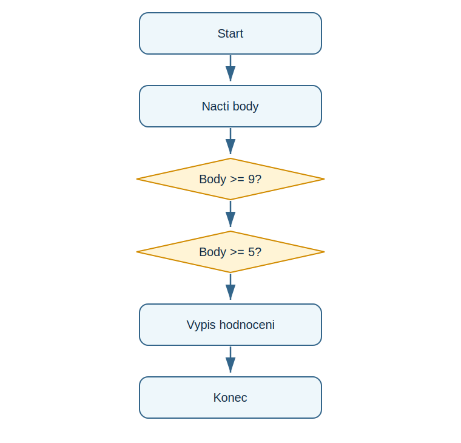

# Lekce 5 - Rozhodování

<div class="lesson-meta">
<strong>Doporučený čas:</strong> 60 minut<br>
<strong>Výstup lekce:</strong> Student zápise podminku if/elif/else a umí vysvětlit větveni programu.<br>
<strong>Zdrojová předloha:</strong> Python-first steps-p.51, část Making decisions
</div>

## Co se dnes naučíš

- porovnat hodnoty pomocí operatoru
- použít if a else
- přidat další větev elif
- cist odsazeny blok kódu

## Proč to potřebujeme

V PDF se program začíná rozhodovat podle situace: jina odpověď, jine skóre, jina zprava. To je první krok od pevného scenare k interaktivnimu programu.

!!! info "Důležitá myšlenka"
    Podminka je otázka s odpovědi ano/ne. Podle odpovědi Python vybere, ktery odsazeny blok provede.

## Analýza problému

- vstupem je počet bodu
- program porovna body s hranicemi
- provede prave jednu odpovidajici větev
- výstupem je slovni hodnoceni

## Schéma průběhu

{ .flowchart }

## Ukázkový program

```python title="code/rozhodovani.py" linenums="1"
score = int(input("Pocet bodu: "))

if score >= 9:
    print("Vyborne")
elif score >= 5:
    print("Dobre")
else:
    print("Zkus to znovu")
```

[Stáhnout soubor `rozhodovani.py`](code/rozhodovani.py){ .md-button .md-button--primary }

## Rozbor programu

| Část programu | Význam |
| --- | --- |
| `if score >= 9:` | první test |
| `elif score >= 5:` | další moznost, kdyz první neplati |
| `else:` | všechny zbyvajici pripady |
| odsazení | oznacuje příkazy uvnitr větve |

## Zkus změnit

- Otestuj hodnoty 10, 9, 8, 5, 4 a 0.
- Změň hranici pro vyborne hodnoceni.
- Přidej větev pro plny počet bodu.

## Časté chyby

!!! warning "Častá chyba: Chybi dvojtecka"
    **Proč vznikne:** Radek s if/elif/else musi koncit dvojteckou.

    **Oprava:** Doplň `:` za podminku.

!!! warning "Častá chyba: Spatne odsazení"
    **Proč vznikne:** Python nevi, ktere příkazy patri do větve.

    **Oprava:** Odsad příkazy ve vetvi stejne.

## Tahák

| Zápis | K čemu slouží |
| --- | --- |
| `if podmínka:` | první rozhodnuti |
| `elif podmínka:` | další moznost |
| `else:` | zbyvajici pripady |
| `>=` | větší nebo rovno |

## Co už umím

- [ ] umím zapsat podminku
- [ ] rozumím odsazení bloku
- [ ] umím použít else
- [ ] umím vysvětlit větveni podle flowchartu

## Shrnutí

!!! success "Zapamatuj si"
    Rozhodování mění program z pevné posloupnosti na algoritmus, ktery reaguje na data.
