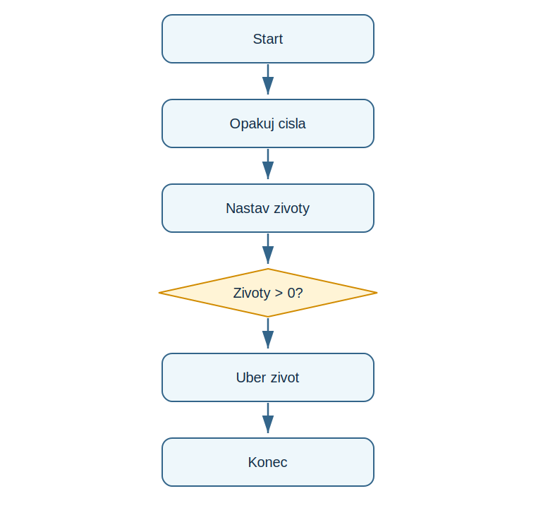

# Lekce 6 - Cykly

<div class="lesson-meta">
<strong>Doporučený čas:</strong> 60-75 minut<br>
<strong>Výstup lekce:</strong> Student opakuje příkazy pomocí for a while a umí poznat podminku ukončení.<br>
<strong>Zdrojová předloha:</strong> Python-first steps-p.51, část Loopy loops
</div>

## Co se dnes naučíš

- použít for s range()
- použít while s podminkou
- změnit hodnotu řídicí proměnné
- odlisit pevny a podmineny počet opakování

## Proč to potřebujeme

PDF vede k opakování, protoze hry a projekty potrebuji delat stejnou věc vickrat: ptat se, kreslít, ubirat životy nebo generovat další vysledek.

!!! info "Důležitá myšlenka"
    Cyklus opakuje odsazeny blok. U for obvykle víme kolikrat, u while opakujeme dokud plati podmínka.

## Analýza problému

- první část vypíše čísla z range()
- druha část ukazuje odpočet životů
- proměnná lives se musi měnit
- cyklus while skonci pri nule

## Schéma průběhu

{ .flowchart }

## Ukázkový program

```python title="code/cykly.py" linenums="1"
for number in range(5):
    print(number)

lives = 3
while lives > 0:
    print("Zbyva životu:", lives)
    lives = lives - 1
```

[Stáhnout soubor `cykly.py`](code/cykly.py){ .md-button .md-button--primary }

## Rozbor programu

| Část programu | Význam |
| --- | --- |
| `range(5)` | vytvoří hodnoty 0 az 4 |
| `while lives > 0:` | opakuje, dokud zbyvaji životy |
| `lives = lives - 1` | mění podminku cyklu |

## Zkus změnit

- Změň `range(5)` na `range(10)`.
- Změň počet životů na 9.
- Zakomentuj řádek, ktery ubira životy, a vysvětlí riziko.

## Časté chyby

!!! warning "Častá chyba: Nekonecny cyklus"
    **Proč vznikne:** Podminka while se nikdy nezmění na False.

    **Oprava:** Uvnitř cyklu Změň hodnotu, ktera je v podmínce.

!!! warning "Častá chyba: Kod neni odsazeny"
    **Proč vznikne:** Prikaz pak nepatri do cyklu.

    **Oprava:** Odsad všechny opakovane radky stejne.

## Tahák

| Zápis | K čemu slouží |
| --- | --- |
| `for x in range(n):` | opakování nkrat |
| `while podmínka:` | opakování podle podmínky |
| `x = x - 1` | Změňseni hodnoty |

## Co už umím

- [ ] umím použít for
- [ ] umím použít while
- [ ] vím, proc se musi měnit podmínka while
- [ ] umím nakreslít cyklus ve flowchartu

## Shrnutí

!!! success "Zapamatuj si"
    Cykly jsou zaklad pro projekty, kde se opakuje dotaz, kreslení nebo vyhodnoceni hry.
