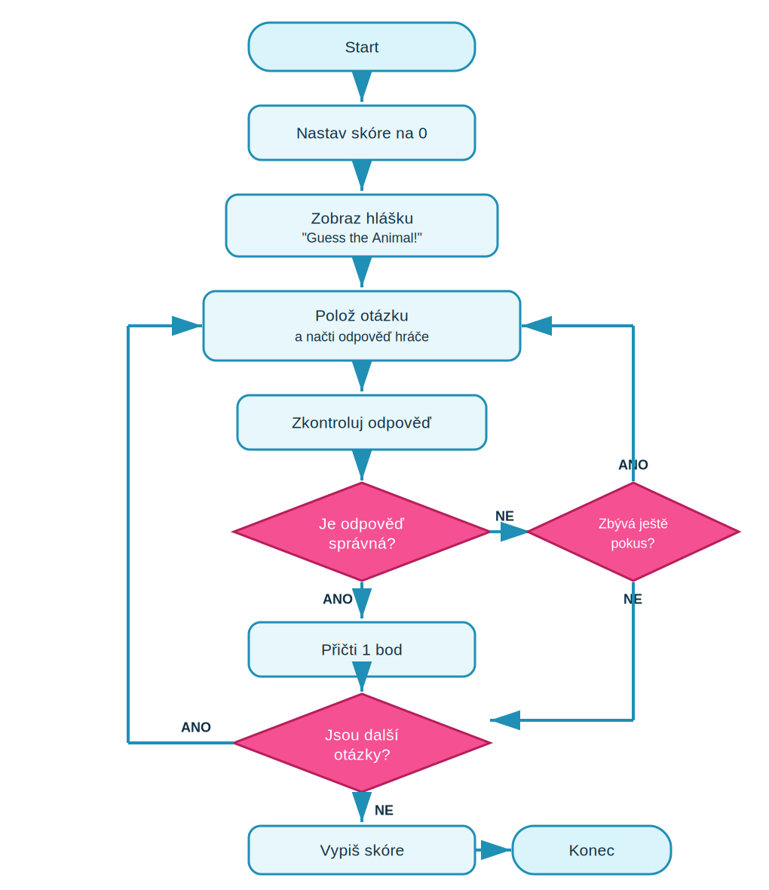

# Lekce 6 - Projekt Zvířecí kvíz (Animal Quiz)

<div class="lesson-meta">
<strong>Doporučený čas:</strong> 90-120 minut<br>
<strong>Výstup lekce:</strong> Student sestaví projekt Animal Quiz se skóre, kontrolní funkcí, více otázkami, ignorováním velikosti písmen a třemi pokusy.<br>
</div>

## Co se dnes naučíš

- ukládat skóre do proměnné `score`
- položit otázku pomocí `input()`
- vytvořit funkci `check_guess()`
- použít `global score`
- vypsat konečné skóre
- porovnávat text tak, aby nezáleželo na velikosti písmen
- dát hráči až tři pokusy

## Proč to děláme

Projekt Animal Quiz propojí všechno, co ses naučil v předchozích lekcích: proměnné, vstup od uživatele, podmínky, cykly i funkce. Výsledkem bude jednoduchý kvíz, který si můžeš snadno upravit na libovolné téma.


## Analýza projektu

- vstupem jsou odpovědi hráče
- skóre se ukládá do proměnné `score`
- funkce `check_guess()` porovnává odpověď se správnou hodnotou
- po špatné odpovědi může hráč odpověď zopakovat
- na konci se zobrazí výsledné skóre

## Schéma průběhu

{ .flowchart }

## 1. Založ nový soubor

Ve VS Code vytvoř nový soubor a ulož ho jako `animal_quiz.py`.

## 2. Připrav skóre a úvod

```python
score = 0

print("Guess the Animal!")
```

Proměnná `score` bude sledovat počet správných odpovědí.

## 3. Přidej první otázky

```python title="code/01_animal_quiz.py" linenums="1"
score = 0

print("Guess the Animal!")

guess1 = input("Which bear lives at the North Pole? ")
if guess1 == "polar bear":
    print("Correct answer")
    score = score + 1

guess2 = input("Which is the fastest land animal? ")
if guess2 == "cheetah":
    print("Correct answer")
    score = score + 1

guess3 = input("Which is the largest animal? ")
if guess3 == "blue whale":
    print("Correct answer")
    score = score + 1

print("Your score is " + str(score))
```

## 4. Vytvoř funkci pro kontrolu

Opakovanou kontrolu přesuneme do funkce `check_guess()`.

```python title="code/02_check_guess.py" linenums="1"
score = 0

def check_guess(guess, answer):
    global score
    if guess == answer:
        print("Correct answer")
        score = score + 1

print("Guess the Animal!")

guess1 = input("Which bear lives at the North Pole? ")
check_guess(guess1, "polar bear")

guess2 = input("Which is the fastest land animal? ")
check_guess(guess2, "cheetah")

guess3 = input("Which is the largest animal? ")
check_guess(guess3, "blue whale")

print("Your score is " + str(score))
```

| Část programu | Význam |
| --- | --- |
| `def check_guess(guess, answer):` | definuje funkci pro kontrolu odpovědi hráče |
| `global score` | umožňuje funkci upravit proměnnou `score` |
| `check_guess(guess1, "polar bear")` | zavolá funkci a zkontroluje odpověď na první otázku |
| `str(score)` | převede číselné skóre na text pro závěrečný výpis |

## 5. Ignoruj velikost písmen a přidej pokusy

Na straně 41 se projekt rozšíří tak, aby hráč dostal tři pokusy a aby nezáleželo na velkých a malých písmenech.

```python title="code/03_attempts.py" linenums="1"
score = 0

def check_guess(guess, answer):
    global score
    still_guessing = True
    attempt = 0

    while still_guessing and attempt < 3:
        if guess.lower() == answer.lower():
            print("Correct answer")
            score = score + 1
            still_guessing = False
        else:
            if attempt < 2:
                guess = input("Sorry, wrong answer. Try again. ")
            attempt = attempt + 1

    if attempt == 3:
        print("The correct answer is " + answer)

print("Guess the Animal!")

guess1 = input("Which bear lives at the North Pole? ")
check_guess(guess1, "polar bear")

guess2 = input("Which is the fastest land animal? ")
check_guess(guess2, "cheetah")

guess3 = input("Which is the largest animal? ")
check_guess(guess3, "blue whale")

print("Your score is " + str(score))
```

## Hacky a úpravy

Hotový kvíz můžeš dál měnit. Vždy si ale novou verzi ulož jako samostatný soubor, aby sis nepokazil původní funkční hru.

### Udělej kvíz delší

Přidej další otázky a ke každé zavolej funkci `check_guess()`. Můžeš začít třeba otázkami ze zvířecího kvízu:

```python
guess = input("Which animal has a long trunk? ")
check_guess(guess, "elephant")

guess = input("What kind of mammal can fly? ")
check_guess(guess, "bat")

guess = input("How many hearts does an octopus have? ")
check_guess(guess, "three")
```

### Vytvoř otázku s možnostmi

U otázky s více možnostmi hráč neodpovídá celým slovem, ale písmenem. Program potom kontroluje, jestli hráč zadal správnou možnost.

```python
guess = input("Which one of these is a fish? A) Whale B) Dolphin C) Shark D) Squid. Type A, B, C, or D ")
check_guess(guess, "C")
```

### Rozděl dlouhou otázku na více řádků

Dlouhý text v `input()` se špatně čte. Znak `\n` vytvoří nový řádek v textu otázky.

```python
guess = input("Which one of these is a fish?\nA) Whale\nB) Dolphin\nC) Shark\nD) Squid\nType A, B, C, or D ")
check_guess(guess, "C")
```

V okně programu se otázka zobrazí přehledně pod sebou:

```text
Which one of these is a fish?
A) Whale
B) Dolphin
C) Shark
D) Squid
Type A, B, C, or D
```

### Vytvoř otázku True / False

Některé otázky mohou mít jen dvě možné odpovědi. Takový kvíz se hodí pro rychlé ověřování tvrzení.

```python
guess = input("Mice are mammals. True or False? ")
check_guess(guess, "True")
```

### Změň obtížnost

Kvíz bude těžší, když hráč dostane méně pokusů. V podmínce cyklu stačí změnit číslo `3` na menší hodnotu.

```python
while still_guessing and attempt < 2:
```

Stejné pravidlo můžeš upravit i u kontroly posledního pokusu:

```python
if attempt == 2:
    print("The correct answer is " + answer)
```

### Dej více bodů za rychlejší odpověď

Hráč může dostat více bodů, když odpoví správně hned napoprvé. Místo jednoho bodu použij výpočet podle počtu pokusů:

```python
score = score + 3 - attempt
```

Když hráč odpoví správně na první pokus, získá 3 body. Na druhý pokus získá 2 body a na třetí pokus 1 bod.

### Změň téma kvízu

Zvířata jsou jen začátek. Stejný program můžeš použít pro kvíz o sportu, filmech, hudbě, škole nebo rodině. Stačí vyměnit otázky a správné odpovědi.

## Časté chyby

!!! warning "Častá chyba: Zapomeneš `global score`"
    **Proč vznikne:** Funkce pak nemůže správně změnit proměnnou `score`, která je mimo funkci.

    **Oprava:** Na začátek funkce `check_guess()` přidej `global score`.

!!! warning "Častá chyba: Odpověď se porovnává moc přísně"
    **Proč vznikne:** `Polar Bear` a `polar bear` nejsou stejný řetězec.

    **Oprava:** Při porovnání použij `.lower()`.

## Tahák

| Zápis | K čemu slouží |
| --- | --- |
| `score = 0` | počáteční skóre |
| `input(...)` | otázka pro hráče |
| `def check_guess(guess, answer):` | funkce pro kontrolu odpovědi |
| `global score` | změna skóre uvnitř funkce |
| `guess.lower()` | převod odpovědi na malá písmena |
| `while still_guessing and attempt < 3:` | nejvýše tři pokusy |

## Co už umím

- [ ] umím založit projektový soubor
- [ ] umím sledovat skóre
- [ ] umím napsat funkci pro kontrolu odpovědi
- [ ] umím zavolat funkci s různými otázkami
- [ ] umím použít `.lower()`
- [ ] umím přidat omezený počet pokusů

## Shrnutí

!!! success "Zapamatuj si"
    Animal Quiz roste po malých krocích. Nejprve má otázky a skóre, potom funkci pro kontrolu, potom výpis skóre, ignorování velikosti písmen a nakonec více pokusů.
