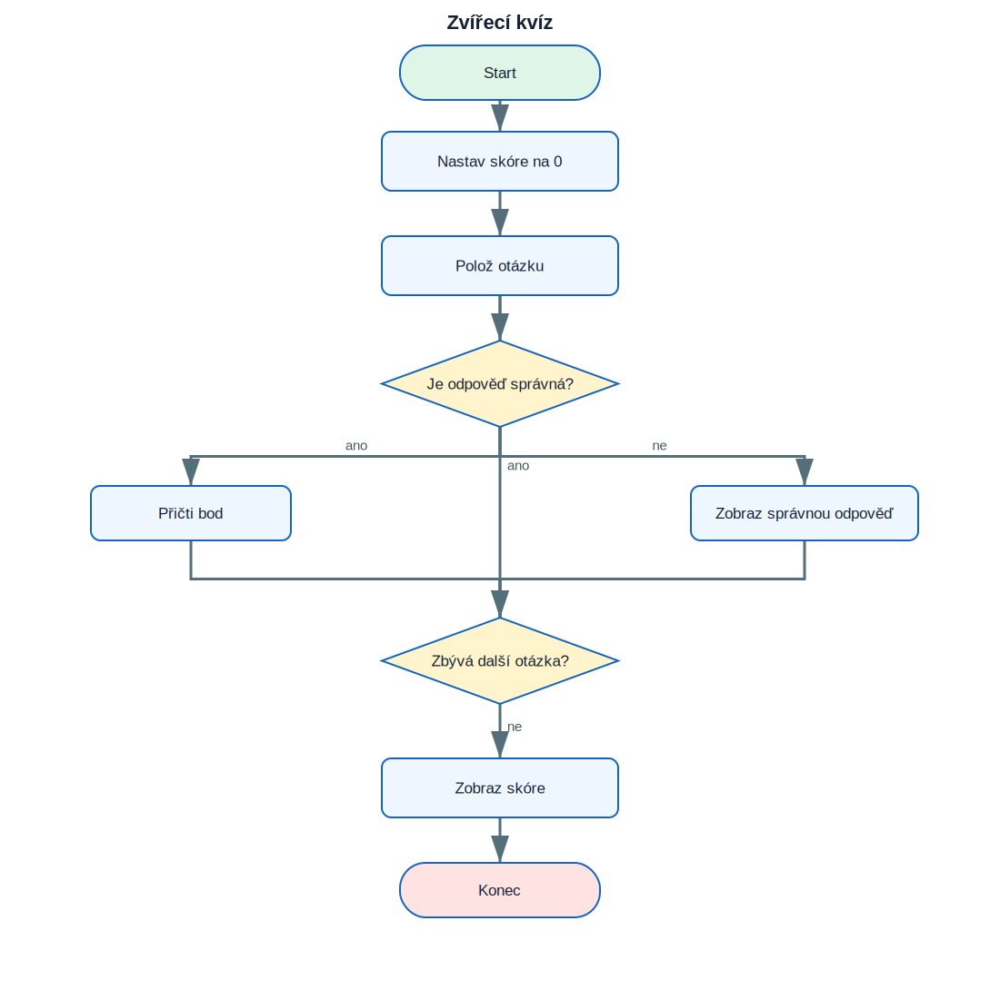

# 7. Projekt Zvířecí kvíz

<div class="lesson-meta">
<strong>Doporučený čas:</strong> 90–120 minut<br>
<strong>Výstup:</strong> Dokážeš analyzovat, sestavit a vysvětlit projekt **Zvířecí kvíz**.
</div>

<div class="project-goal">
<strong>Výsledek projektu:</strong> Program postupně položí tři otázky, vyhodnotí odpovědi a na konci zobrazí počet získaných bodů.
</div>

## Analýza projektu

### Vstupy

- projekt nepoužívá vstup, případně používá odpovědi uvedené v zadání.

### Zpracování

- proměnná `score` uchovává body
- `input()` načítá odpověď
- podmínka porovnává odpověď
- správná odpověď zvýší skóre

### Výstupy

- textový nebo grafický výsledek projektu,
- průběžné informace potřebné pro uživatele.

## Logické schéma

{ .flowchart }

!!! info "Nejdříve schéma, potom kód"
    Ukaž ve schématu místo, kde se program rozhoduje, a část, která se opakuje.

## Stavba programu po krocích

### 1. Připrav prostředí a data

Urči moduly, seznamy, proměnné a počáteční hodnoty.

### 2. Vytvoř hlavní operaci

Napiš část, která provádí hlavní úkol projektu. U grafických projektů je to typicky funkce pro kreslení jednoho prvku.

### 3. Přidej rozhodování a opakování

Porovnej podmínky s logickým schématem. Každý rozhodovací bod ve schématu musí mít odpovídající podmínku v kódu.

### 4. Dokonči a otestuj program

Vyzkoušej běžné i krajní vstupy. U nekonečných grafických programů se program ukončuje zavřením okna nebo přerušením běhu.

## Kompletní kód

```python title="zvireci_kviz.py" linenums="1"
score = 0

print("Zvířecí kvíz")

answer = input("Které zvíře říká mňau? ").lower()
if answer == "kočka":
    print("Správně!")
    score += 1
else:
    print("Špatně. Správná odpověď je kočka.")

answer = input("Kolik nohou má pavouk? ")
if answer == "8":
    print("Správně!")
    score += 1
else:
    print("Špatně. Pavouk má 8 nohou.")

answer = input("Který savec umí létat? ").lower()
if answer == "netopýr":
    print("Správně!")
    score += 1
else:
    print("Špatně. Je to netopýr.")

print("Tvoje skóre je", score, "ze 3.")
```

[Stáhnout soubor `zvireci_kviz.py`](code/zvireci_kviz.py){ .md-button .md-button--primary }

## Kontrola porozumění

- [ ] Dokážu vysvětlit vstupy a výstupy programu.
- [ ] Dokážu najít hlavní cyklus.
- [ ] Dokážu určit, které části kódu odpovídají rozhodovacím bodům ve schématu.
- [ ] Dokážu změnit jednu hodnotu a předem odhadnout důsledek.
