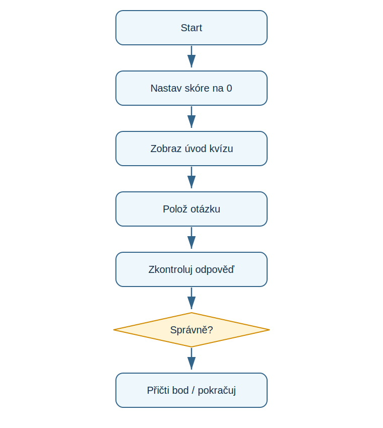

# Lekce 7 - Projekt Zvířecí kvíz

<div class="lesson-meta">
<strong>Doporučený čas:</strong> 75-90 minut<br>
<strong>Výstup lekce:</strong> Student sestavi textovy kvíz s otázkami, rozhodováním a skóre.<br>
<strong>Zdrojová předloha:</strong> Python-first steps-p.51, projekt Animal Quiz
</div>

## Co se dnes naučíš

- rozebrat kvíz na vstupy, vyhodnoceni a vystup
- opakovat vzor otázka-odpověď
- pocitat skóre
- otestovat ruzne odpovědi

## Proč to potřebujeme

Projekt v PDF spojuje dosavadni dovednosti: textovy vystup, input(), podmínky a jednoduchou proměnnou pro skóre.

!!! info "Důležitá myšlenka"
    Kazda otázka ma stejny algoritmus: poloz otazku, nacti odpověď, porovnej ji se spravnou odpovědi a podle vysledku uprav skóre.

!!! example "Projekt podle PDF"
    Student sestavi textovy kvíz s otázkami, rozhodováním a skóre.

## Analýza projektu

- vstupem jsou odpovědi hráče
- kazda odpověď se porovna se spravnou hodnotou
- proměnná score pocita správně odpovědi
- výstupem jsou zpravy po otázkach a konecne skóre

## Schéma průběhu

{ .flowchart }

## Projekt

```python title="code/zvireci_kviz.py" linenums="1"
score = 0

print("Zvireci kviz")

answer = input("Ktere zvire rika mnau? ").lower()
if answer == "kocka":
    print("Spravne!")
    score = score + 1
else:
    print("Spatne. Spravna odpoved je kocka.")

answer = input("Kolik nohou ma pavouk? ")
if answer == "8":
    print("Spravne!")
    score = score + 1
else:
    print("Spatne. Pavouk ma 8 nohou.")

answer = input("Ktery savěc umi letat? ").lower()
if answer == "netopyr":
    print("Spravne!")
    score = score + 1
else:
    print("Spatne. Je to netopyr.")

print("Tvoje skore je", score, "ze 3.")
```

[Stáhnout soubor `zvireci_kviz.py`](code/zvireci_kviz.py){ .md-button .md-button--primary }

## Rozbor programu

| Část programu | Význam |
| --- | --- |
| `score = 0` | začátek pocitadla |
| `.lower()` | sjednoti odpověď na malá písmena |
| `score = score + 1` | pripocita bod za spravnou odpověď |

## Zkus změnit

- Přidej čtvrtou otazku podle stejneho vzoru.
- Zkus zadat odpověď s velkým písmenem.
- Změň zaverecny výpis tak, aby obsahoval krátké hodnoceni.

## Časté chyby

!!! warning "Častá chyba: Skore se nezvysuje"
    **Proč vznikne:** Program vypíše správně, ale neupravi proměnnou.

    **Oprava:** Do správně větve přidej `score = score + 1`.

!!! warning "Častá chyba: Odpoved s diakritikou neprojde"
    **Proč vznikne:** Program porovnava presny text.

    **Oprava:** Domluv presny tvar odpovědi nebo prijmi více variant.

## Tahák

| Zápis | K čemu slouží |
| --- | --- |
| `==` | porovnani hodnot |
| `.lower()` | prevod textu na malá písmena |
| `score = score + 1` | zvyseni pocitadla |

## Co už umím

- [ ] umím rozlozit kvíz na kroky
- [ ] umím pocitat body
- [ ] umím opakovat vzor otazky
- [ ] umím otestovat spravnou i spatnou odpověď

## Shrnutí

!!! success "Zapamatuj si"
    Zvířecí kvíz je první uceleny projekt: maly, ale uz ma vstupy, rozhodování, stav programu a zaverecny vysledek.
