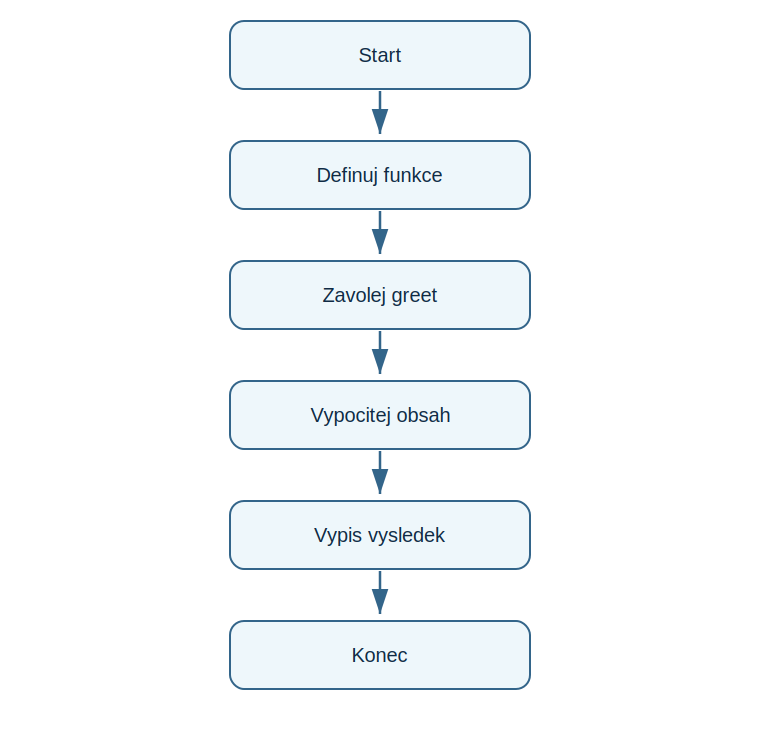

# Lekce 8 - Funkce

<div class="lesson-meta">
<strong>Doporučený čas:</strong> 60-75 minut<br>
<strong>Výstup lekce:</strong> Student definuje vlastní funkci, zavola ji a použije parametr nebo navratovou hodnotu.<br>
<strong>Zdrojová předloha:</strong> Python-first steps-p.51, část Functions
</div>

## Co se dnes naučíš

- vysvětlit proc funkce seskupuji kód
- zapsat def
- predat parametr
- vratit vysledek pomocí return

## Proč to potřebujeme

Jakmile se podobny postup opakuje, PDF prechazi k funkcim. Funkce pomaha pojménovat část programu a použít ji znovu.

!!! info "Důležitá myšlenka"
    Funkce je pojménovany blok kódu. Sama se nespustí pri definici; spustí se az pri zavolani.

## Analýza problému

- funkce greet vypíše pozdrav pro zadane jméno
- funkce rectangle_area vrati vypočítánou hodnotu
- hlavní část programu funkce vola
- výstupem je pozdrav a číslo

## Schéma průběhu

{ .flowchart }

## Ukázkový program

```python title="code/funkce.py" linenums="1"
def greet(name):
    print("Ahoj", name)

def rectangle_area(width, height):
    return width * height

greet("Ada")
area = rectangle_area(5, 3)
print(area)
```

[Stáhnout soubor `funkce.py`](code/funkce.py){ .md-button .md-button--primary }

## Rozbor programu

| Část programu | Význam |
| --- | --- |
| `def greet(name):` | definice funkce s parametrem |
| `return width * height` | vrati vysledek volajici části programu |
| `greet("Ada")` | volani funkce |

## Zkus změnit

- Zavolej greet pro další jméno.
- Změň rozmery obdélníku.
- Pridavej funkci pro obsah ctverce.

## Časté chyby

!!! warning "Častá chyba: Funkce se neprovede"
    **Proč vznikne:** Byla jen definovana, ale ne zavolana.

    **Oprava:** Pod definici přidej volani funkce.

!!! warning "Častá chyba: Chybi odsazení tela funkce"
    **Proč vznikne:** Python nevi, co do funkce patri.

    **Oprava:** Odsad příkazy uvnitr funkce.

## Tahák

| Zápis | K čemu slouží |
| --- | --- |
| `def name():` | definice funkce |
| parametr | hodnota predana funkci |
| `return` | vraceni vysledku |

## Co už umím

- [ ] umím definovat funkci
- [ ] umím funkci zavolat
- [ ] rozumím parametrů
- [ ] vím, kdy použít return

## Shrnutí

!!! success "Zapamatuj si"
    Funkce davaji programu strukturu. Dalsi projekty diky nim nebudou jen dlouhy seznam příkazů.
