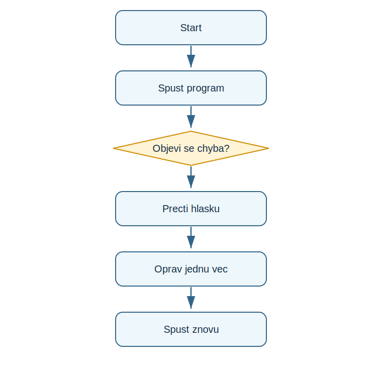

# Lekce 9 - Hledání a oprava chyb

<div class="lesson-meta">
<strong>Doporučený čas:</strong> 45-60 minut<br>
<strong>Výstup lekce:</strong> Student rozlisi syntaktickou, behovou a logickou chybu a použije postup ladění.<br>
<strong>Zdrojová předloha:</strong> Python-first steps-p.51, část Fixing bugs
</div>

## Co se dnes naučíš

- cist chybovou hlášku od konce k podstate
- najít řádek chyby
- rozlisit typy chyb
- opravovat program malými kroky

## Proč to potřebujeme

PDF nebere chyby jako selhani, ale jako normální součást programování. Student se uci použít chybu jako informaci.

!!! info "Důležitá myšlenka"
    Chybova hláška je zprava od Pythonu. Neopravi program sama, ale napovi řádek, typ problemu a nekdy i presnou pricinu.

## Analýza problému

- program ma načíst jméno
- potom vypsat pozdrav
- nakonec spocitat jednoduchy priklad
- oprava spociva v doplňeni vstupu a správněm typu hodnot

## Schéma průběhu

{ .flowchart }

## Ukázkový program

```python title="code/oprav_chyby.py" linenums="1"
name = input("Jmeno: ")
print("Ahoj", name)
print(10 + 5)
```

[Stáhnout soubor `oprav_chyby.py`](code/oprav_chyby.py){ .md-button .md-button--primary }

## Rozbor programu

| Část programu | Význam |
| --- | --- |
| `NameError` | částo znáména překlep nebo neexistující proměnnou |
| `SyntaxError` | Python nerozumí zápisu |
| logicka chyba | program bezi, ale vysledek je špatně |

## Zkus změnit

- Schvalne prepis `name` na `nmae` a přečti chybu.
- Odstran závorku v print().
- Změň `10 + 5` na textove scitani a porovnej vysledek.

## Časté chyby

!!! warning "Častá chyba: Opravuji mnoho věci naraz"
    **Proč vznikne:** Pak neni jasne, ktera změna pomohla.

    **Oprava:** Men jednu věc a program znovu spust.

!!! warning "Častá chyba: Ignoruji poslední radky chyby"
    **Proč vznikne:** Tam byva nejdulezitejsi typ a popis.

    **Oprava:** Zacni čtením konce chybové hlášky.

## Tahák

| Zápis | K čemu slouží |
| --- | --- |
| `SyntaxError` | chyba zápisu |
| `NameError` | neznámé jméno |
| `TypeError` | špatný typ hodnoty |

## Co už umím

- [ ] umím precist chybovou hlášku
- [ ] umím najít řádek chyby
- [ ] umím opravit překlep v proměnné
- [ ] beru chybu jako stopu pro ladění

## Shrnutí

!!! success "Zapamatuj si"
    Ladeni je dovednost. Cim drive se student nauci cist chybové hlášky, tim samostatněji muze pracovat na projektech.
