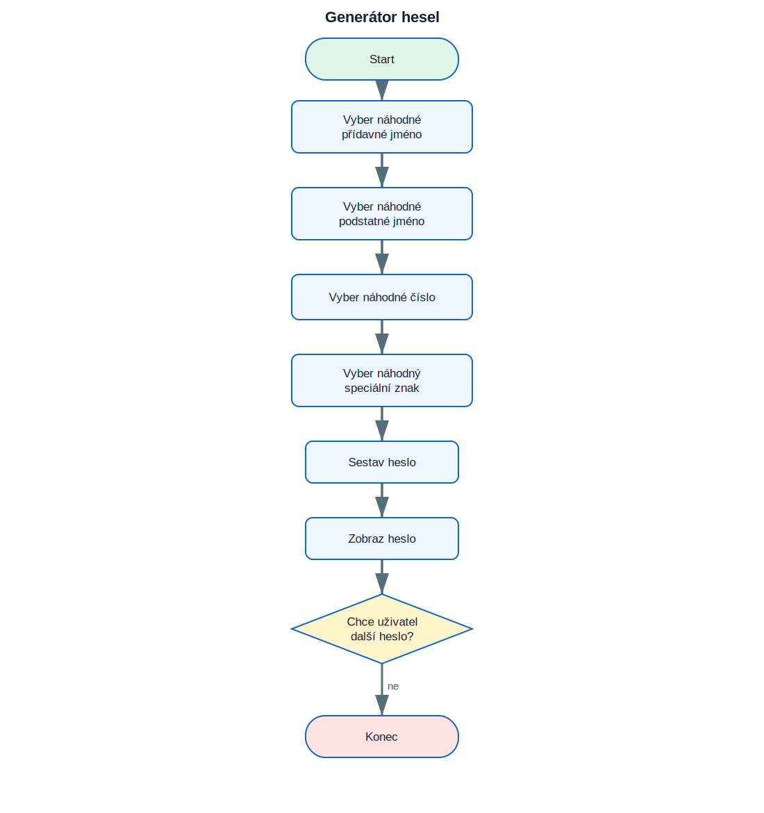

# 10. Projekt Generátor hesel

<div class="lesson-meta">
<strong>Doporučený čas:</strong> 90–120 minut<br>
<strong>Výstup:</strong> Dokážeš analyzovat, sestavit a vysvětlit projekt **Generátor hesel**.
</div>

<div class="project-goal">
<strong>Výsledek projektu:</strong> Program skládá heslo z náhodně vybraného přídavného jména, podstatného jména, čísla a speciálního znaku. Uživatel může vytvářet další hesla.
</div>

## Analýza projektu

### Vstupy

- odpověď uživatele, zda chce vytvořit další heslo.

### Zpracování

- seznam přídavných jmen
- seznam podstatných jmen
- náhodné číslo
- náhodný znak z `string.punctuation`
- cyklus pro opakované generování

### Výstupy

- textový nebo grafický výsledek projektu,
- průběžné informace potřebné pro uživatele.

## Logické schéma

{ .flowchart }

!!! info "Nejdříve schéma, potom kód"
    Ukaž ve schématu místo, kde se program rozhoduje, a část, která se opakuje.

## Stavba programu po krocích

### 1. Připrav prostředí a data

Urči moduly, seznamy, proměnné a počáteční hodnoty.

### 2. Vytvoř hlavní operaci

Napiš část, která provádí hlavní úkol projektu. U grafických projektů je to typicky funkce pro kreslení jednoho prvku.

### 3. Přidej rozhodování a opakování

Porovnej podmínky s logickým schématem. Každý rozhodovací bod ve schématu musí mít odpovídající podmínku v kódu.

### 4. Dokonči a otestuj program

Vyzkoušej běžné i krajní vstupy. U nekonečných grafických programů se program ukončuje zavřením okna nebo přerušením běhu.

## Kompletní kód

```python title="generator_hesel.py" linenums="1"
import random
import string

adjectives = ["sleepy", "slow", "smelly", "wet", "fat", "red", "orange", "yellow", "green", "blue", "purple", "fluffy", "white", "proud", "brave"]
nouns = ["apple", "dinosaur", "ball", "toaster", "goat", "dragon", "hammer", "duck", "panda"]

print("Welcome to Password Picker!")

while True:
    adjective = random.choice(adjectives)
    noun = random.choice(nouns)
    number = random.randrange(0, 100)
    special_char = random.choice(string.punctuation)

    password = adjective + noun + str(number) + special_char
    print("Your new password is:", password)

    response = input("Would you like another password? Type y or n: ")
    if response == "n":
        break
```

[Stáhnout soubor `generator_hesel.py`](code/generator_hesel.py){ .md-button .md-button--primary }

## Kontrola porozumění

- [ ] Dokážu vysvětlit vstupy a výstupy programu.
- [ ] Dokážu najít hlavní cyklus.
- [ ] Dokážu určit, které části kódu odpovídají rozhodovacím bodům ve schématu.
- [ ] Dokážu změnit jednu hodnotu a předem odhadnout důsledek.
