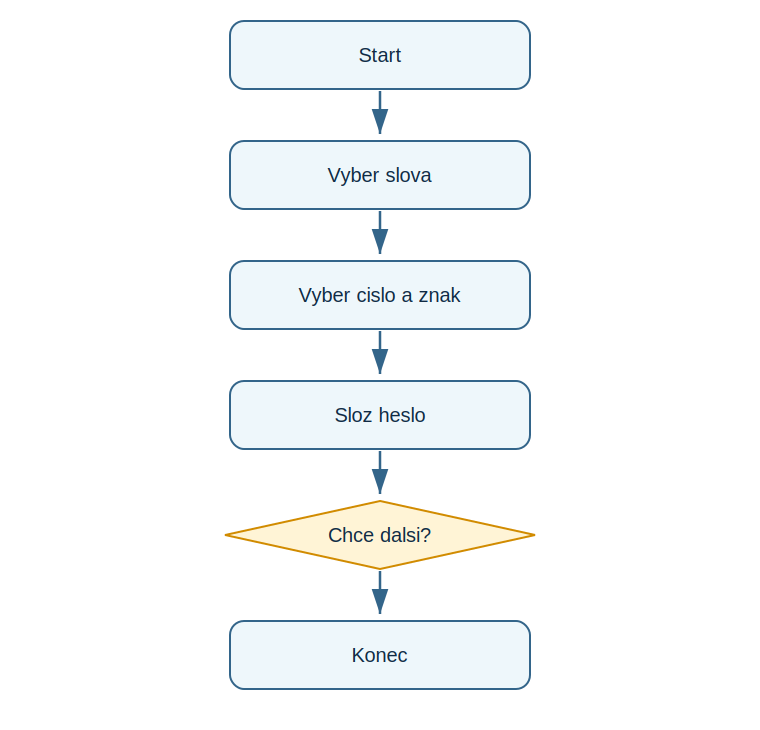

# Lekce 10 - Projekt Generátor hesel

<div class="lesson-meta">
<strong>Doporučený čas:</strong> 90 minut<br>
<strong>Výstup lekce:</strong> Student vytvoří program, ktery sklada náhodně heslo a umí generovani opakovat.<br>
<strong>Zdrojová předloha:</strong> Python_52-107, projekt Password Picker
</div>

## Co se dnes naučíš

- použít seznamy slov
- vybrat náhodně hodnoty
- slozit textove heslo
- opakovat generovani podle odpovědi uživatele

## Proč to potřebujeme

Navazujici PDF začíná praktickym projektem Password Picker. Projekt prirozene spojuje seznamy, modul random, text a cyklus while.

!!! info "Důležitá myšlenka"
    Silnejsi heslo muze vzniknout kombinaci nekolika nezavíšle vybranych části. Program ukazuje, jak lze náhodu spojit s retezci.

!!! example "Projekt podle PDF"
    Student vytvoří program, ktery sklada náhodně heslo a umí generovani opakovat.

## Analýza projektu

- vstupem je odpověď, zda chce uživatel další heslo
- program vybere přidávne jméno a podstatne jméno ze seznamu
- přidá číslo a speciální znak
- cyklus konci pri odpovědi n

## Schéma průběhu

{ .flowchart }

## Projekt

```python title="code/generator_hesel.py" linenums="1"
import random
import string

adjectives = ["sleepy", "slow", "red", "green", "brave", "proud"]
nouns = ["apple", "dinosaur", "panda", "rocket", "dragon"]

print("Password Picker")

while True:
    adjective = random.choice(adjectives)
    noun = random.choice(nouns)
    number = random.randrange(0, 100)
    special_char = random.choice(string.punctuation)

    password = adjective + noun + str(number) + special_char
    print("Your new password is:", password)

    response = input("Would you like another password? Type y or n: ")
    if response == "n":
        break
```

[Stáhnout soubor `generator_hesel.py`](code/generator_hesel.py){ .md-button .md-button--primary }

## Rozbor programu

| Část programu | Význam |
| --- | --- |
| `random.choice(...)` | vybere nahodnou polozku |
| `string.punctuation` | sada speciálních znaků |
| `str(number)` | převede číslo na text pro spojení |
| `break` | ukončí cyklus |

## Zkus změnit

- Přidej vlastní slova do obou seznamu.
- Změň rozsah náhodněho čísla.
- Uprav program tak, aby heslo melo vzdy oddelovac mezi slovy.

## Časté chyby

!!! warning "Častá chyba: Nelze spojit číslo s textem"
    **Proč vznikne:** Cislo neni řetězec.

    **Oprava:** Použij `str(number)`.

!!! warning "Častá chyba: Cyklus nikdy neskonci"
    **Proč vznikne:** Odpoved uživatele se netestuje správně.

    **Oprava:** Zkontroluj podminku `if response == "n"`.

## Tahák

| Zápis | K čemu slouží |
| --- | --- |
| `import random` | modul pro náhodu |
| `random.randrange(a, b)` | náhodně cele číslo |
| `break` | predčasne ukončení cyklu |

## Co už umím

- [ ] umím popsat části hesla
- [ ] umím použít náhodný výběr
- [ ] umím vysvětlit while True
- [ ] umím bezpečně ukončít cyklus

## Shrnutí

!!! success "Zapamatuj si"
    Generátor hesel je první projekt druhe části: pracuje s nahodou, seznamy, retezci a opakováním.
