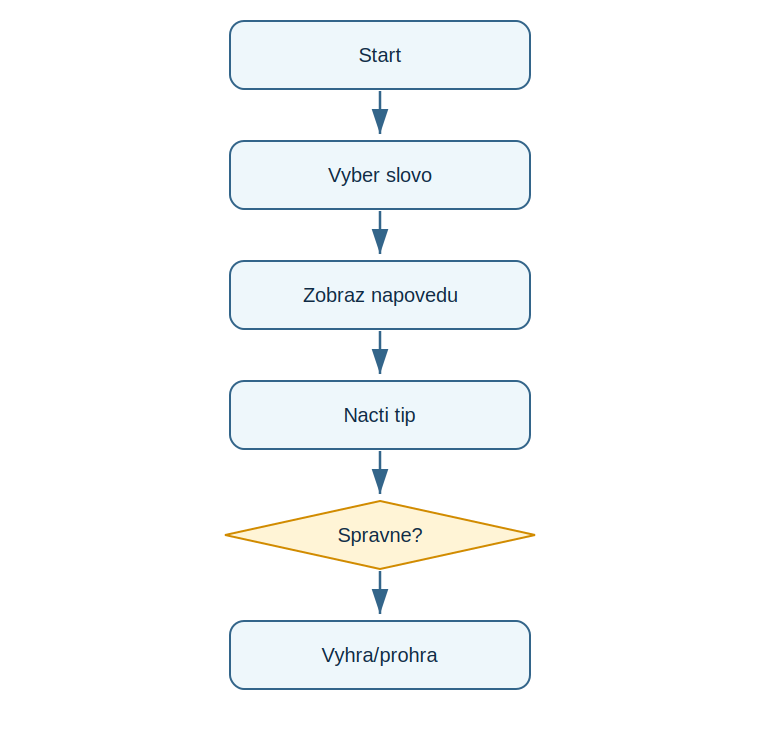

# Lekce 11 - Projekt Devět životů

<div class="lesson-meta">
<strong>Doporučený čas:</strong> 90-120 minut<br>
<strong>Výstup lekce:</strong> Student vytvoří hádací hru se skrytým slovem, nápovědou a omezeným počtem životů.<br>
<strong>Zdrojová předloha:</strong> Python_52-107, projekt Nine Lives
</div>

## Co se dnes naučíš

- vybrat tajné slovo ze seznamu
- udrzovat nápovědu jako seznam znaků
- ubirat životy pri chybe
- použít funkci pro aktualizaci nápovědy

## Proč to potřebujeme

Nine Lives v PDF je větší textová hra. Vyžaduje spojit seznamy, náhodu, while, if a funkci do jednoho uceleného programu.

!!! info "Důležitá myšlenka"
    Hra ma stav: tajné slovo, nápovědu, počet životů a informaci, jestli hráč výhral. Každý tah tento stav mění.

!!! example "Projekt podle PDF"
    Student vytvoří hádací hru se skrytým slovem, nápovědou a omezeným počtem životů.

## Analýza projektu

- vstupem je písmeno nebo celé slovo
- tajné slovo se vybere náhodně
- nápověda začíná jako otazniky
- správná písmena se doplní do nápovědy
- špatný tip ubere život

## Schéma průběhu

{ .flowchart }

## Projekt

```python title="code/devet_zivotu.py" linenums="1"
import random

lives = 9
words = ["pizza", "fairy", "teeth", "shirt", "otter", "plane"]
secret_word = random.choice(words)
clue = list("?????")
guessed_word_correctly = False

def update_clue(guessed_letter, secret_word, clue):
    index = 0
    while index < len(secret_word):
        if guessed_letter == secret_word[index]:
            clue[index] = guessed_letter
        index = index + 1

while lives > 0:
    print(clue)
    print("Lives left:", "<3 " * lives)
    guess = input("Guess a letter or the whole word: ")

    if guess == secret_word:
        guessed_word_correctly = True
        break

    if guess in secret_word:
        update_clue(guess, secret_word, clue)
    else:
        print("Incorrect. You lose a life.")
        lives = lives - 1

    if "?" not in clue:
        guessed_word_correctly = True
        break

if guessed_word_correctly:
    print("You won! The secret word was", secret_word)
else:
    print("You lost! The secret word was", secret_word)
```

[Stáhnout soubor `devet_zivotu.py`](code/devet_zivotu.py){ .md-button .md-button--primary }

## Rozbor programu

| Část programu | Význam |
| --- | --- |
| `clue = list("?????")` | nápověda, kterou lze měnit po znacich |
| `update_clue(...)` | funkce najde všechny pozice písmene |
| `while lives > 0` | hlavní herní cyklus |
| `if "?" not in clue` | kontrola, zda je slovo cele odkryté |

## Zkus změnit

- Přidej další pětipísmenná slova.
- Vypis tajné slovo pri ladění a potom výpis odstran.
- Změň počet životů a sleduj dopad na obtížnost.

## Časté chyby

!!! warning "Častá chyba: Slovo ma jinou délku nez nápověda"
    **Proč vznikne:** Nápověda ma pet otazníků.

    **Oprava:** Pouzivej pětipísmenná slova nebo vytvor nápovědu podle délky slova.

!!! warning "Častá chyba: Funkce mění spatnou proměnnou"
    **Proč vznikne:** Názvy parametrů a proměnných se pletou.

    **Oprava:** Projdi funkci řádek po řádků s konkrétním písmenem.

## Tahák

| Zápis | K čemu slouží |
| --- | --- |
| `in` | test výskytu hodnoty |
| `not in` | test, ze hodnota chybí |
| `break` | ukončení cyklu |
| `list("?????")` | seznam znaků |

## Co už umím

- [ ] umím popsat stav hry
- [ ] umím vysvětlit funkci update_clue
- [ ] umím najít podmínky výhry a prohry
- [ ] umím upravit seznam slov

## Shrnutí

!!! success "Zapamatuj si"
    Devět životů je první opravdu stavova hra. Uci premyslet o tom, co si program musi pamatovat mezi tahy.
