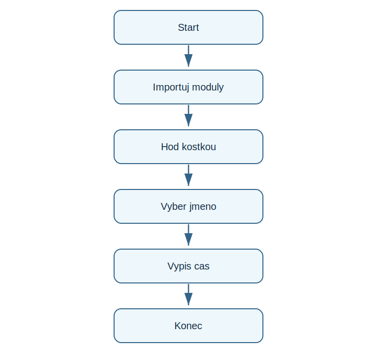

# Lekce 11 - Moduly

<div class="lesson-meta">
<strong>Doporučený čas:</strong> 45-60 minut<br>
<strong>Výstup lekce:</strong> Student importuje modul, použije funkci z modulu a rozumí ruznym formam importu.<br>
<strong>Zdrojová předloha:</strong> Python_52-107, prace s knihovnami v projektech
</div>

## Co se dnes naučíš

- vysvětlit modul jako sadu hotovych nastroju
- použít import random
- použít from ... import ...
- poznat alias u importu

## Proč to potřebujeme

PDF projekty pouzivaji hotove knihovny: random pro náhodu, string pro znaky, turtle pro grafiku. Modul neni zkratka z uceni, ale běžná praxe.

!!! info "Důležitá myšlenka"
    Modul rozsiri Python o další funkce. Po importu muzeme použít nástroje, ktere v zakladnim prostoru jmen nebyly.

## Analýza problému

- program importuje random a time
- náhodně hodi kostkou
- vybere náhodně jméno
- ukaze aktuální čas jako priklad funkce z modulu

## Schéma průběhu

{ .flowchart }

## Ukázkový program

```python title="code/moduly.py" linenums="1"
import random
from random import choice
from time import ctime as current_time

print(random.randint(1, 6))
print(choice(["Ada", "Grace", "Linus"]))
print(current_time())
```

[Stáhnout soubor `moduly.py`](code/moduly.py){ .md-button .md-button--primary }

## Rozbor programu

| Část programu | Význam |
| --- | --- |
| `import random` | modul se pouziva s predponou `random.` |
| `from random import choice` | importuje jednu funkci primo |
| `as current_time` | da importovane funkci jine jméno |

## Zkus změnit

- Změň rozsah v randint().
- Přidej další jmena do seznamu.
- Zkus zavolat `randint()` bez `random.` a vysvětlí rozdil.

## Časté chyby

!!! warning "Častá chyba: Modul neni importovan"
    **Proč vznikne:** Python funkci nezná.

    **Oprava:** Na začátek souboru přidej odpovidajici import.

!!! warning "Častá chyba: Michani stylu importu"
    **Proč vznikne:** Neni jasne, kdy psat predponu modulu.

    **Oprava:** Drz se v jedne ukazce jednoho stylu, pokud to jde.

## Tahák

| Zápis | K čemu slouží |
| --- | --- |
| `import modul` | import celeho modulu |
| `modul.funkce()` | volani funkce z modulu |
| `from modul import funkce` | import jedne funkce |
| `as` | alias |

## Co už umím

- [ ] vím, proc se moduly pouzivaji
- [ ] umím importovat random
- [ ] umím zavolat funkci z modulu
- [ ] rozumím rozdilu mezi import styly

## Shrnutí

!!! success "Zapamatuj si"
    Moduly oteviraji cestu k větším projektum bez toho, aby student musel vse programovat od nuly.
