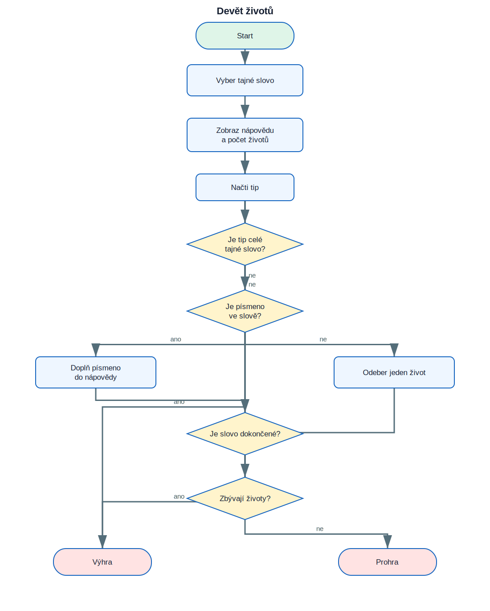

# 12. Projekt Devět životů

<div class="lesson-meta">
<strong>Doporučený čas:</strong> 90–120 minut<br>
<strong>Výstup:</strong> Dokážeš analyzovat, sestavit a vysvětlit projekt **Devět životů**.
</div>

<div class="project-goal">
<strong>Výsledek projektu:</strong> Program vybere tajné pětimístné slovo. Hráč hádá písmena nebo celé slovo. Každý chybný tip odebere jeden z devíti životů.
</div>

## Analýza projektu

### Vstupy

- tip hráče: jedno písmeno nebo celé slovo.

### Zpracování

- tajné slovo je vybráno náhodně
- nápověda začíná pěti otazníky
- funkce doplňuje správně uhodnutá písmena
- cyklus končí výhrou nebo vyčerpáním životů

### Výstupy

- textový nebo grafický výsledek projektu,
- průběžné informace potřebné pro uživatele.

## Logické schéma

{ .flowchart }

!!! info "Nejdříve schéma, potom kód"
    Ukaž ve schématu místo, kde se program rozhoduje, a část, která se opakuje.

## Stavba programu po krocích

### 1. Připrav prostředí a data

Urči moduly, seznamy, proměnné a počáteční hodnoty.

### 2. Vytvoř hlavní operaci

Napiš část, která provádí hlavní úkol projektu. U grafických projektů je to typicky funkce pro kreslení jednoho prvku.

### 3. Přidej rozhodování a opakování

Porovnej podmínky s logickým schématem. Každý rozhodovací bod ve schématu musí mít odpovídající podmínku v kódu.

### 4. Dokonči a otestuj program

Vyzkoušej běžné i krajní vstupy. U nekonečných grafických programů se program ukončuje zavřením okna nebo přerušením běhu.

## Kompletní kód

```python title="devet_zivotu.py" linenums="1"
import random

lives = 9
words = ["pizza", "fairy", "teeth", "shirt", "otter", "plane"]
secret_word = random.choice(words)
clue = list("?????")
heart_symbol = "♥"
guessed_word_correctly = False

def update_clue(guessed_letter, secret_word, clue):
    index = 0
    while index < len(secret_word):
        if guessed_letter == secret_word[index]:
            clue[index] = guessed_letter
        index += 1

while lives > 0:
    print(clue)
    print("Lives left:", heart_symbol * lives)
    guess = input("Guess a letter or the whole word: ")

    if guess == secret_word:
        guessed_word_correctly = True
        break

    if guess in secret_word:
        update_clue(guess, secret_word, clue)
    else:
        print("Incorrect. You lose a life.")
        lives -= 1

    if "?" not in clue:
        guessed_word_correctly = True
        break

if guessed_word_correctly:
    print("You won! The secret word was", secret_word)
else:
    print("You lost! The secret word was", secret_word)
```

[Stáhnout soubor `devet_zivotu.py`](code/devet_zivotu.py){ .md-button .md-button--primary }

## Kontrola porozumění

- [ ] Dokážu vysvětlit vstupy a výstupy programu.
- [ ] Dokážu najít hlavní cyklus.
- [ ] Dokážu určit, které části kódu odpovídají rozhodovacím bodům ve schématu.
- [ ] Dokážu změnit jednu hodnotu a předem odhadnout důsledek.
