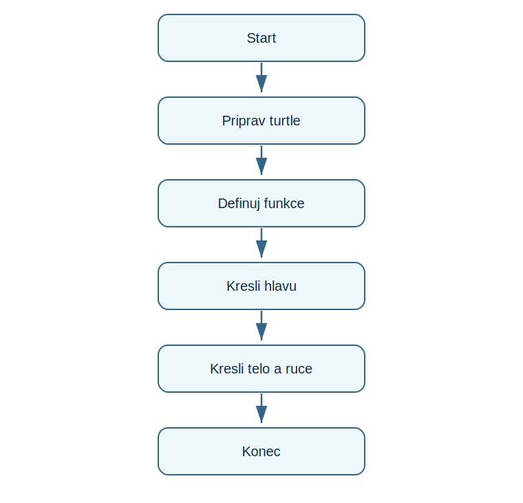

# Lekce 13 - Projekt Stavitel robota

<div class="lesson-meta">
<strong>Doporučený čas:</strong> 90-120 minut<br>
<strong>Výstup lekce:</strong> Student kreslí robota z obdélníku a kruhu pomocí pomocne funkce.<br>
<strong>Zdrojová předloha:</strong> Python_52-107, turtle projekt Robot Builder
</div>

## Co se dnes naučíš

- rozlozit obrázek na jednoduche tvary
- vytvořít funkci pro obdélník
- používat souřadnice pro skladani části
- pracovat s barvou výplně

## Proč to potřebujeme

Robot v PDF ukazuje, ze větší kresbu nemusime kreslít chaoticky. Nejprve ji rozlozime na části a kazdou část umístime na plátno.

!!! info "Důležitá myšlenka"
    Slozity obrázek se sklada z jednoduchych tvaru. Funkce pro obdélník odstrani opakování a zprehledni kreslení.

!!! example "Projekt podle PDF"
    Student kreslí robota z obdélníku a kruhu pomocí pomocne funkce.

## Analýza projektu

- vstup od uživatele neni potreba
- program kreslí části robota v pevném pořadí
- funkce rectangle kreslí výplňěný obdélník
- výstupem je hotovy obrázek robota

## Schéma průběhu

{ .flowchart }

## Projekt

```python title="code/stavitel_robota.py" linenums="1"
import turtle as t

t.speed("fastest")
t.hideturtle()

def rectangle(width, height, color):
    t.fillcolor(color)
    t.begin_fill()
    for side in range(2):
        t.forward(width)
        t.right(90)
        t.forward(height)
        t.right(90)
    t.end_fill()

def move_to(x, y):
    t.penup()
    t.goto(x, y)
    t.pendown()

move_to(-60, 80)
rectangle(120, 80, "steelblue")
move_to(-35, -5)
rectangle(70, 95, "gray")
move_to(-70, -25)
rectangle(30, 90, "orange")
move_to(40, -25)
rectangle(30, 90, "orange")
move_to(-25, 95)
t.dot(16, "white")
move_to(25, 95)
t.dot(16, "white")
move_to(-25, 45)
rectangle(50, 10, "black")

t.done()
```

[Stáhnout soubor `stavitel_robota.py`](code/stavitel_robota.py){ .md-button .md-button--primary }

## Rozbor programu

| Část programu | Význam |
| --- | --- |
| `rectangle(...)` | jedna funkce pro opakovany tvar |
| `begin_fill()` / `end_fill()` | vybarveni tvaru |
| `move_to(...)` | presun bez kreslení cary |
| pořadí volani | urcuje, ktere části se kreslí driv |

## Zkus změnit

- Změň barvu tela robota.
- Pridavej antenu nebo tlacitka jen z uz znamych tvaru.
- Zkus změnit souřadnice jedne části a popis dopad.

## Časté chyby

!!! warning "Častá chyba: Za presunem zustava cara"
    **Proč vznikne:** Pero nebylo zvednute.

    **Oprava:** Pred goto použij penup() a po presunu pendown().

!!! warning "Častá chyba: Vypln nefunguje"
    **Proč vznikne:** Chybi dvojice begin_fill/end_fill.

    **Oprava:** Obal kreslení tvaru obema příkazy.

## Tahák

| Zápis | K čemu slouží |
| --- | --- |
| `t.goto(x, y)` | presun na souřadnice |
| `t.fillcolor(c)` | barva výplně |
| `t.begin_fill()` | začátek výplně |
| `t.dot(size, color)` | kruh nebo bod |

## Co už umím

- [ ] umím rozlozit kresbu na části
- [ ] umím použít pomocnou funkci
- [ ] umím kreslít výplněne tvary
- [ ] umím upravit souřadnice části robota

## Shrnutí

!!! success "Zapamatuj si"
    Stavitel robota ukazuje, ze graficky projekt začíná analyzou tvaru a jejich pořadí, ne samotnym psanim příkazů.
