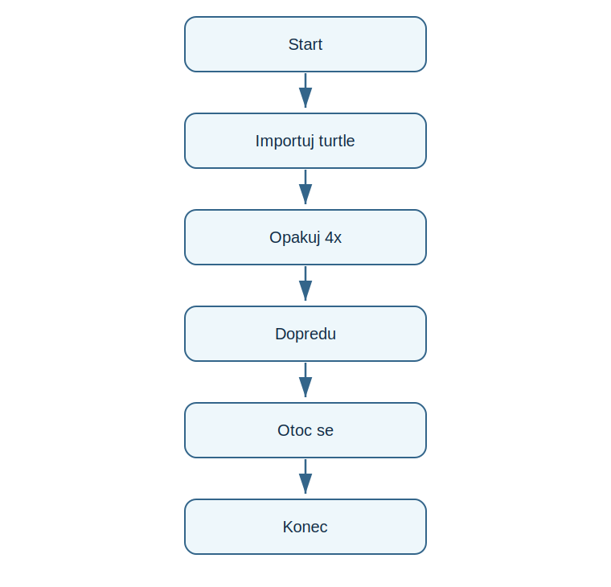

# Lekce 13 - Úvod do Turtle Graphics

<div class="lesson-meta">
<strong>Doporučený čas:</strong> 60 minut<br>
<strong>Výstup lekce:</strong> Student nakreslí jednoduche tvary pomocí turtle a rozumí pohybu želvy po platne.<br>
<strong>Zdrojová předloha:</strong> Python_52-107, uvod do Turtle graphics
</div>

## Co se dnes naučíš

- importovat turtle
- pohnout zelvou dopredu
- otocit zelvu
- nakreslít čtverec cyklem
- rozumet souřadnicim plátna

## Proč to potřebujeme

PDF prechazi od textovych programu ke grafice. Turtle je nazorna: příkazy okamzite vytvari stopu na obrazovce.

!!! info "Důležitá myšlenka"
    Zelva ma pozici a smer. Když se pohne s perem dole, kreslí caru. Když se otoci, změní další smer kreslení.

## Analýza problému

- program importuje turtle jako t
- čtverec vznikne ctyrmi stejnymi kroky
- for cyklus omezi opakování
- výstupem je grafické okno

## Schéma průběhu

{ .flowchart }

## Ukázkový program

```python title="code/turtle_uvod.py" linenums="1"
import turtle as t

for side in range(4):
    t.forward(100)
    t.right(90)

t.done()
```

[Stáhnout soubor `turtle_uvod.py`](code/turtle_uvod.py){ .md-button .md-button--primary }

## Rozbor programu

| Část programu | Význam |
| --- | --- |
| `import turtle as t` | zkrati název modulu |
| `t.forward(100)` | pohyb dopredu o 100 bodu |
| `t.right(90)` | otoceni doprava o pravy uhel |
| `t.done()` | ponecha okno otevrene |

## Zkus změnit

- Změň délku strany.
- Změň uhel na 120 a sleduj tvar.
- Nakreslí obdélník bez cyklu a potom s cyklem.

## Časté chyby

!!! warning "Častá chyba: Okno se hned zavre"
    **Proč vznikne:** Program skonci a prostředí zavre kreslíci okno.

    **Oprava:** Na konec přidej `t.done()`.

!!! warning "Častá chyba: Tvar se neuzavre"
    **Proč vznikne:** Uhel nebo počet opakování nesedi.

    **Oprava:** Pro čtverec použij 4 opakování a 90 stupnu.

## Tahák

| Zápis | K čemu slouží |
| --- | --- |
| `t.forward(n)` | pohyb dopredu |
| `t.right(a)` | otoceni doprava |
| `t.penup()` | zvednuti pera |
| `t.goto(x, y)` | presun na souřadnice |

## Co už umím

- [ ] umím spustit turtle program
- [ ] umím nakreslít čtverec
- [ ] rozumím uhlu otoceni
- [ ] vím, co dela t.done()

## Shrnutí

!!! success "Zapamatuj si"
    Turtle prevadi algoritmus na obraz. Stejne cykly a funkce, ktere znas z textu, ted ridi kreslení.
