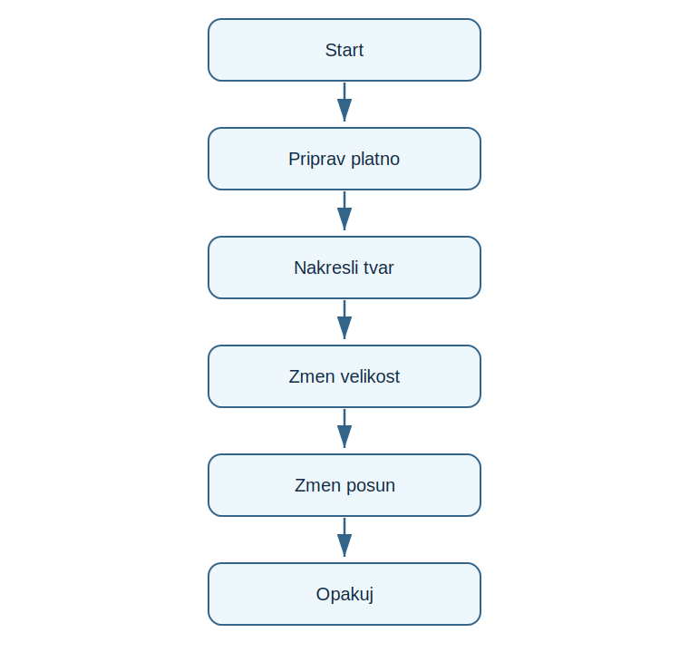

# Lekce 14 - Projekt Kaleido-spirála

<div class="lesson-meta">
<strong>Doporučený čas:</strong> 90 minut<br>
<strong>Výstup lekce:</strong> Student vytvoří opakujici se barevnou spiralovou kresbu s náhodnými barvami.<br>
<strong>Zdrojová předloha:</strong> Python_52-107, turtle projekt kaleidoskopicke spiraly
</div>

## Co se dnes naučíš

- použít nekonecny kreslíci cyklus
- měnit barvy náhodně
- vytvořít funkci pro jeden krok kresby
- pozorovat vliv uhlu, velikosti a posunu

## Proč to potřebujeme

Kaleidoskopicke projekty v PDF ukazuji silu malych Změň v cyklu. Jednoduchy krok, opakovany mnohokrat, vytvoří slozity obraz.

!!! info "Důležitá myšlenka"
    Spirala nevznikne jednim příkazem. Vznikne opakováním podobneho tvaru, kde se po kazdem kroku trochu změní pozice nebo smer.

!!! example "Projekt podle PDF"
    Student vytvoří opakujici se barevnou spiralovou kresbu s náhodnými barvami.

## Analýza projektu

- program nema textovy vstup
- funkce kreslí jeden kruh a posune zelvu
- barva se voli náhodně
- cyklus bezi do preruseni programu nebo zavreni okna

## Schéma průběhu

{ .flowchart }

## Projekt

```python title="code/kaleido_spirala.py" linenums="1"
import turtle
from random import randint

turtle.bgcolor("black")
turtle.speed("fastest")
turtle.hideturtle()
turtle.colormode(255)

def draw_shape(size, angle, shift):
    turtle.pencolor(randint(0, 255), randint(0, 255), randint(0, 255))
    turtle.circle(size)
    turtle.right(angle)
    turtle.forward(shift)

size = 30
angle = 59
shift = 1

while True:
    draw_shape(size, angle, shift)
    size = size + 1
    shift = shift + 1
```

[Stáhnout soubor `kaleido_spirala.py`](code/kaleido_spirala.py){ .md-button .md-button--primary }

## Rozbor programu

| Část programu | Význam |
| --- | --- |
| `turtle.colormode(255)` | barvy jako hodnoty 0-255 |
| `draw_shape(...)` | jeden krok spiraly |
| `size = size + 1` | postupna změna velikosti |
| `while True` | kreslení pokracuje bez pevného poctu kroku |

## Zkus změnit

- Změň uhel na 90, 91 nebo 121.
- Změňsi nebo zvětší pocatecni velikost.
- Zamen barvu pozadi.

## Časté chyby

!!! warning "Častá chyba: Barvy nefunguji jako trojice čísel"
    **Proč vznikne:** Neni nastaven colormode(255).

    **Oprava:** Pred kreslením přidej `turtle.colormode(255)`.

!!! warning "Častá chyba: Program nejde prirozene ukončít"
    **Proč vznikne:** while True bezi stale.

    **Oprava:** U grafickych nekonecnych programu pocitej s ukončením okna nebo prerusenim behu.

## Tahák

| Zápis | K čemu slouží |
| --- | --- |
| `randint(0, 255)` | náhodná barevna složka |
| `circle(size)` | kruh |
| `while True` | nekonecny cyklus |

## Co už umím

- [ ] umím vysvětlit jeden krok spiraly
- [ ] umím měnit parametry kresby
- [ ] umím použít nahodnou barvu
- [ ] vím, proc je cyklus nekonecny

## Shrnutí

!!! success "Zapamatuj si"
    Kaleido-spirála stoji na opakování a malych změnach. Je to krasny priklad algoritmicke grafiky.
