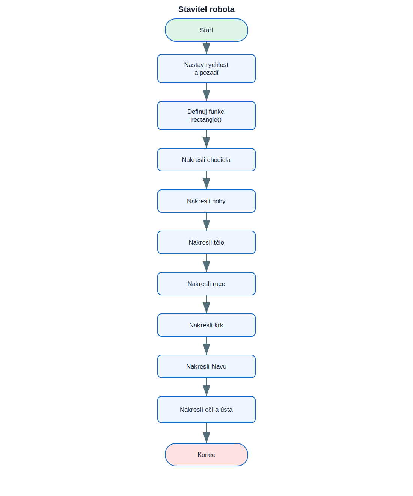

# 14. Projekt Stavitel robota

<div class="lesson-meta">
<strong>Doporučený čas:</strong> 90–120 minut<br>
<strong>Výstup:</strong> Dokážeš analyzovat, sestavit a vysvětlit projekt **Stavitel robota**.
</div>

<div class="project-goal">
<strong>Výsledek projektu:</strong> Program používá jednu funkci pro kreslení barevných obdélníků. Z obdélníků postupně sestaví chodidla, nohy, tělo, paže, krk, hlavu a obličej.
</div>

## Analýza projektu

### Vstupy

- projekt nepoužívá vstup, případně používá odpovědi uvedené v zadání.

### Zpracování

- funkce `rectangle()` kreslí vyplněný obdélník
- `goto()` přesouvá želvu na výchozí bod dílu
- každá část robota má polohu, rozměry a barvu

### Výstupy

- textový nebo grafický výsledek projektu,
- průběžné informace potřebné pro uživatele.

## Logické schéma

{ .flowchart }

!!! info "Nejdříve schéma, potom kód"
    Ukaž ve schématu místo, kde se program rozhoduje, a část, která se opakuje.

## Stavba programu po krocích

### 1. Připrav prostředí a data

Urči moduly, seznamy, proměnné a počáteční hodnoty.

### 2. Vytvoř hlavní operaci

Napiš část, která provádí hlavní úkol projektu. U grafických projektů je to typicky funkce pro kreslení jednoho prvku.

### 3. Přidej rozhodování a opakování

Porovnej podmínky s logickým schématem. Každý rozhodovací bod ve schématu musí mít odpovídající podmínku v kódu.

### 4. Dokonči a otestuj program

Vyzkoušej běžné i krajní vstupy. U nekonečných grafických programů se program ukončuje zavřením okna nebo přerušením běhu.

## Kompletní kód

```python title="stavitel_robota.py" linenums="1"
import turtle as t

t.speed("fastest")
t.bgcolor("Dodger blue")

def rectangle(horizontal, vertical, color):
    t.pendown()
    t.pensize(1)
    t.color(color)
    t.begin_fill()
    for _ in range(2):
        t.forward(horizontal)
        t.right(90)
        t.forward(vertical)
        t.right(90)
    t.end_fill()
    t.penup()

# Feet
t.goto(-100, -150)
rectangle(50, 20, "blue")
t.goto(-30, -150)
rectangle(50, 20, "blue")

# Legs
t.goto(-75, -50)
rectangle(15, 100, "grey")
t.goto(-10, -50)
rectangle(15, 100, "grey")

# Body
t.goto(-90, 100)
rectangle(100, 150, "red")

# Arms
t.goto(-150, 70)
rectangle(60, 15, "grey")
t.goto(10, 70)
rectangle(60, 15, "grey")

# Neck
t.goto(-50, 120)
rectangle(15, 20, "grey")

# Head
t.goto(-85, 170)
rectangle(80, 50, "red")

# Eyes
t.goto(-60, 160)
rectangle(10, 5, "white")
t.goto(-30, 160)
rectangle(10, 5, "white")

# Mouth
t.goto(-65, 135)
rectangle(40, 5, "black")

t.hideturtle()
t.done()
```

[Stáhnout soubor `stavitel_robota.py`](code/stavitel_robota.py){ .md-button .md-button--primary }

## Kontrola porozumění

- [ ] Dokážu vysvětlit vstupy a výstupy programu.
- [ ] Dokážu najít hlavní cyklus.
- [ ] Dokážu určit, které části kódu odpovídají rozhodovacím bodům ve schématu.
- [ ] Dokážu změnit jednu hodnotu a předem odhadnout důsledek.
