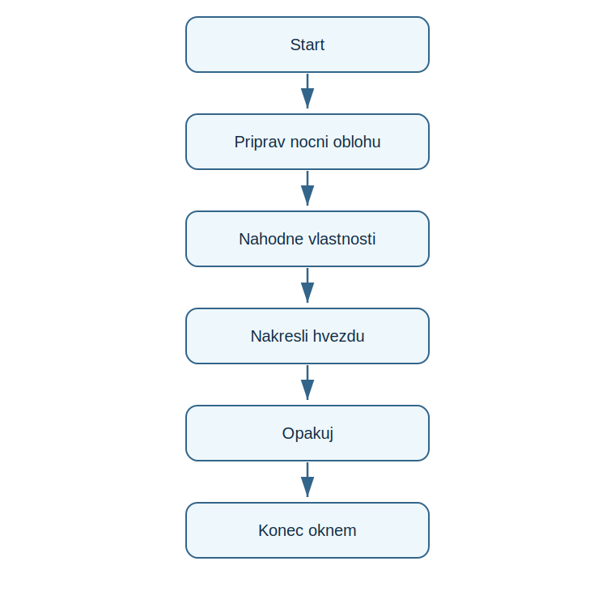

# Lekce 15 - Projekt Hvězdná noc

<div class="lesson-meta">
<strong>Doporučený čas:</strong> 90 minut<br>
<strong>Výstup lekce:</strong> Student kreslí hvězdy na náhodných pozicich s nahodnou velikosti a barvou.<br>
<strong>Zdrojová předloha:</strong> Python_52-107, turtle projekt Starry Night
</div>

## Co se dnes naučíš

- vytvořít funkci pro hvezdu
- používat náhodně souřadnice
- kombinovat for a while
- změnit velikost a barvu kresleneho prvku

## Proč to potřebujeme

PDF projekt hvezdne oblohy ukazuje, jak se funkce a nahoda doplňuji: funkce popisuje jednu hvezdu, nahoda ridi, kde a jaka se objevi další.

!!! info "Důležitá myšlenka"
    Jeden dobre popsany tvar se muze objevit mnohokrat. Rozmanitost v obrazu zajisti parametry a náhodně hodnoty.

!!! example "Projekt podle PDF"
    Student kreslí hvězdy na náhodných pozicich s nahodnou velikosti a barvou.

## Analýza projektu

- program nema vstup od uživatele
- funkce draw_star kreslí jednu hvezdu
- pozice, velikost a barva se voli náhodně
- cyklus přidáva další a další hvězdy

## Schéma průběhu

{ .flowchart }

## Projekt

```python title="code/hvezdna_noc.py" linenums="1"
import turtle as t
from random import randint, random

t.bgcolor("midnightblue")
t.speed("fastest")
t.hideturtle()

def draw_star(points, size, color, x, y):
    t.penup()
    t.goto(x, y)
    t.pendown()
    t.pencolor(color)

    for point in range(points):
        t.forward(size)
        t.right(180 - 180 / points)

while True:
    points = randint(5, 8)
    size = randint(20, 80)
    color = (random(), random(), random())
    x = randint(-300, 300)
    y = randint(-250, 250)
    draw_star(points, size, color, x, y)
```

[Stáhnout soubor `hvezdna_noc.py`](code/hvezdna_noc.py){ .md-button .md-button--primary }

## Rozbor programu

| Část programu | Význam |
| --- | --- |
| `draw_star(...)` | parametry urcuji vzhled a pozici jedne hvězdy |
| `randint(-300, 300)` | náhodná souřadnice |
| `random()` | náhodná barevna složka 0-1 |
| `for point in range(points)` | kreslení hvězdy po hranach |

## Zkus změnit

- Změň rozsah velikosti hvezd.
- Omez hvězdy jen na horni polovinu okna.
- Změň barvu pozadi na cernou nebo tmave fialovou.

## Časté chyby

!!! warning "Častá chyba: Hvezdy jsou spojene carami"
    **Proč vznikne:** Pero zustalo dole pri presunu.

    **Oprava:** Ve funkci presouvej zelvu s penup().

!!! warning "Častá chyba: Tvar nevypada jako hvězda"
    **Proč vznikne:** Uhel otoceni neodpovida poctu bodu.

    **Oprava:** Zachovej vztah `180 - 180 / points`.

## Tahák

| Zápis | K čemu slouží |
| --- | --- |
| `randint(a, b)` | náhodně cele číslo |
| `random()` | náhodně desetinne číslo |
| parametry funkce | rizeni kresby zvenku |

## Co už umím

- [ ] umím popsat parametry hvězdy
- [ ] umím náhodně zvolit souřadnice
- [ ] umím vysvětlit presun bez kreslení
- [ ] umím upravit hustotu a velikost hvezd

## Shrnutí

!!! success "Zapamatuj si"
    Hvězdná noc ukazuje, jak funkce vytvari jeden prvek a cyklus z nej sklada celou scenu.
