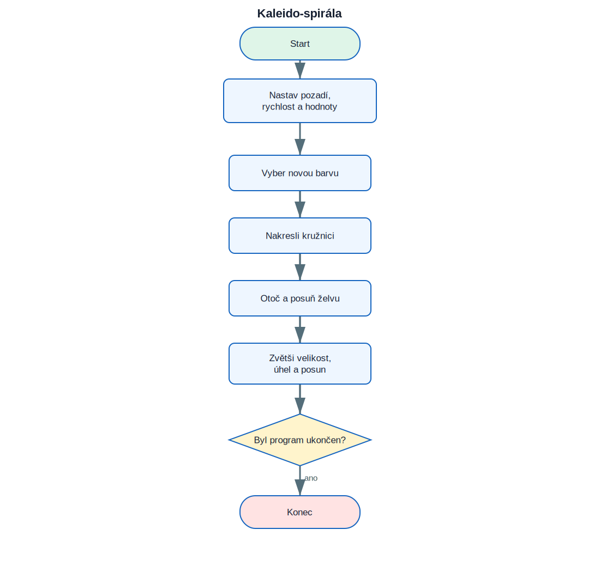

# 15. Projekt Kaleido-spirála

<div class="lesson-meta">
<strong>Doporučený čas:</strong> 90–120 minut<br>
<strong>Výstup:</strong> Dokážeš analyzovat, sestavit a vysvětlit projekt **Kaleido-spirála**.
</div>

<div class="project-goal">
<strong>Výsledek projektu:</strong> Želva kreslí stále větší kružnice. Po každé kružnici se otočí, posune a změní barvu. Překrýváním vzniká spirálový obrazec.
</div>

## Analýza projektu

### Vstupy

- projekt nepoužívá vstup, případně používá odpovědi uvedené v zadání.

### Zpracování

- nekonečný cyklus
- náhodná RGB barva
- měnící se velikost, úhel a posun
- opakované kreslení kružnic

### Výstupy

- textový nebo grafický výsledek projektu,
- průběžné informace potřebné pro uživatele.

## Logické schéma

{ .flowchart }

!!! info "Nejdříve schéma, potom kód"
    Ukaž ve schématu místo, kde se program rozhoduje, a část, která se opakuje.

## Stavba programu po krocích

### 1. Připrav prostředí a data

Urči moduly, seznamy, proměnné a počáteční hodnoty.

### 2. Vytvoř hlavní operaci

Napiš část, která provádí hlavní úkol projektu. U grafických projektů je to typicky funkce pro kreslení jednoho prvku.

### 3. Přidej rozhodování a opakování

Porovnej podmínky s logickým schématem. Každý rozhodovací bod ve schématu musí mít odpovídající podmínku v kódu.

### 4. Dokonči a otestuj program

Vyzkoušej běžné i krajní vstupy. U nekonečných grafických programů se program ukončuje zavřením okna nebo přerušením běhu.

## Kompletní kód

```python title="kaleido_spirala.py" linenums="1"
import turtle
from random import randint

turtle.bgcolor("black")
turtle.speed("fastest")
turtle.hideturtle()

def draw_shape(size, angle, shift, shape):
    turtle.pencolor(randint(0, 255), randint(0, 255), randint(0, 255))
    turtle.circle(size)
    turtle.right(angle)
    turtle.forward(shift)
    turtle.shape(shape)

turtle.colormode(255)
size = 10
angle = 0
shift = 1

while True:
    draw_shape(size, angle, shift, "circle")
    size += 1
    angle += 1
    shift += 1
```

[Stáhnout soubor `kaleido_spirala.py`](code/kaleido_spirala.py){ .md-button .md-button--primary }

## Kontrola porozumění

- [ ] Dokážu vysvětlit vstupy a výstupy programu.
- [ ] Dokážu najít hlavní cyklus.
- [ ] Dokážu určit, které části kódu odpovídají rozhodovacím bodům ve schématu.
- [ ] Dokážu změnit jednu hodnotu a předem odhadnout důsledek.
