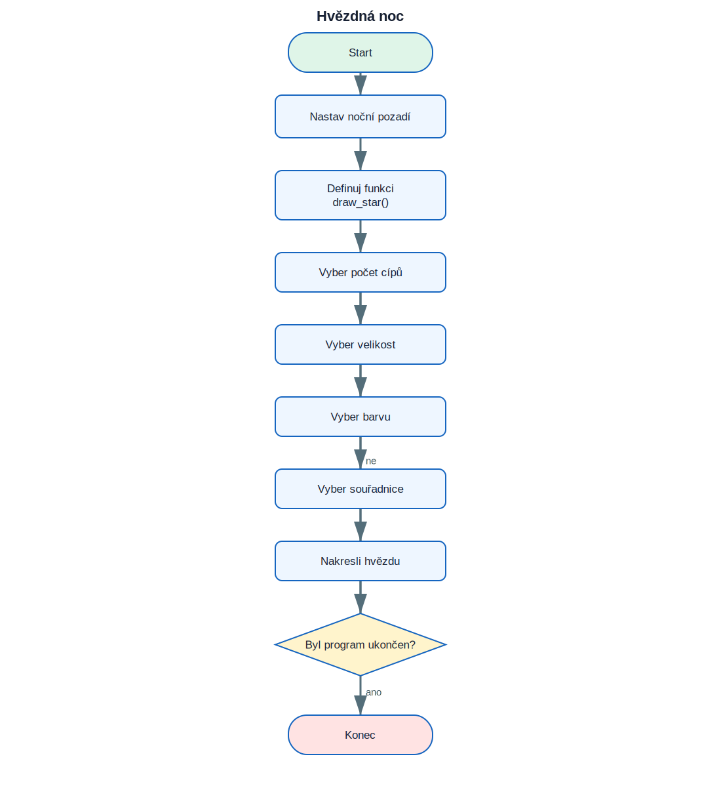

# 16. Projekt Hvězdná noc

<div class="lesson-meta">
<strong>Doporučený čas:</strong> 90–120 minut<br>
<strong>Výstup:</strong> Dokážeš analyzovat, sestavit a vysvětlit projekt **Hvězdná noc**.
</div>

<div class="project-goal">
<strong>Výsledek projektu:</strong> Program opakovaně vytváří hvězdy s náhodným počtem cípů, velikostí, barvou a polohou na tmavém pozadí.
</div>

## Analýza projektu

### Vstupy

- projekt nepoužívá vstup, případně používá odpovědi uvedené v zadání.

### Zpracování

- funkce `draw_star()` kreslí jednu hvězdu
- počet cípů je lichý
- barva i souřadnice jsou náhodné
- hlavní cyklus vytváří další hvězdy

### Výstupy

- textový nebo grafický výsledek projektu,
- průběžné informace potřebné pro uživatele.

## Logické schéma

{ .flowchart }

!!! info "Nejdříve schéma, potom kód"
    Ukaž ve schématu místo, kde se program rozhoduje, a část, která se opakuje.

## Stavba programu po krocích

### 1. Připrav prostředí a data

Urči moduly, seznamy, proměnné a počáteční hodnoty.

### 2. Vytvoř hlavní operaci

Napiš část, která provádí hlavní úkol projektu. U grafických projektů je to typicky funkce pro kreslení jednoho prvku.

### 3. Přidej rozhodování a opakování

Porovnej podmínky s logickým schématem. Každý rozhodovací bod ve schématu musí mít odpovídající podmínku v kódu.

### 4. Dokonči a otestuj program

Vyzkoušej běžné i krajní vstupy. U nekonečných grafických programů se program ukončuje zavřením okna nebo přerušením běhu.

## Kompletní kód

```python title="hvezdna_noc.py" linenums="1"
import turtle as t
from random import randint, random

t.speed("fastest")
t.bgcolor("midnight blue")
t.hideturtle()

def draw_star(points, size, color, x, y):
    t.penup()
    t.goto(x, y)
    t.pendown()
    t.color(color)
    t.begin_fill()
    angle = 180 - (180 / points)
    for _ in range(points):
        t.forward(size)
        t.right(angle)
    t.end_fill()

while True:
    points = randint(2, 5) * 2 + 1
    size = randint(10, 50)
    color = (random(), random(), random())
    x = randint(-350, 300)
    y = randint(-250, 250)
    draw_star(points, size, color, x, y)
```

[Stáhnout soubor `hvezdna_noc.py`](code/hvezdna_noc.py){ .md-button .md-button--primary }

## Kontrola porozumění

- [ ] Dokážu vysvětlit vstupy a výstupy programu.
- [ ] Dokážu najít hlavní cyklus.
- [ ] Dokážu určit, které části kódu odpovídají rozhodovacím bodům ve schématu.
- [ ] Dokážu změnit jednu hodnotu a předem odhadnout důsledek.
