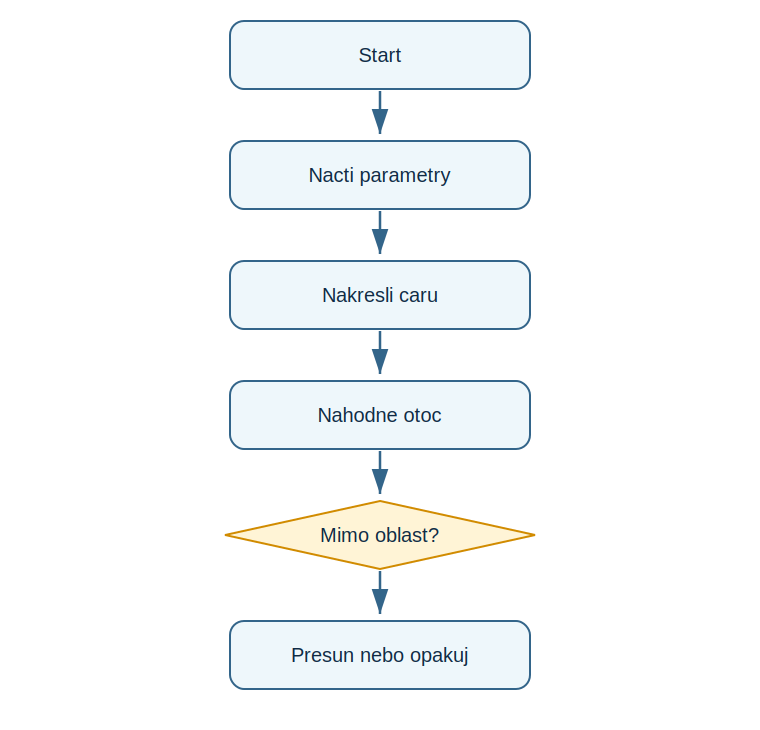

# Lekce 16 - Projekt Mutantní duha

<div class="lesson-meta">
<strong>Doporučený čas:</strong> 90-120 minut<br>
<strong>Výstup lekce:</strong> Student vytvoří nahodnou barevnou kresbu, jejiz parametry predem zvoli uživatel.<br>
<strong>Zdrojová předloha:</strong> Python_52-107, zaverecny turtle projekt Mutant Rainbow
</div>

## Co se dnes naučíš

- načíst volbu uživatele
- převést volbu na parametr kreslení
- kreslít náhodně smerovane cary
- hlidat hranice kreslíci oblasti

## Proč to potřebujeme

Zaverecny projekt PDF propojuje interaktivni vstup s grafickou nahodou. Student uz nepise jen obrázek, ale program s nastavěním.

!!! info "Důležitá myšlenka"
    Program nejprve zjisti pravidla kresby od uživatele. Potom v cyklu kreslí cary, mění barvu a smer a hlida, zda se želva neztratila mimo oblast.

!!! example "Projekt podle PDF"
    Student vytvoří nahodnou barevnou kresbu, jejiz parametry predem zvoli uživatel.

## Analýza projektu

- vstupem je délka a šířka cary
- funkce vraci číselnou hodnotu podle textove volby
- každý krok vybere nahodnou barvu a smer
- pri opusteni oblasti se želva presune zpet na náhodně místo

## Schéma průběhu

{ .flowchart }

## Projekt

```python title="code/mutantni_duha.py" linenums="1"
import turtle as t
from random import randint

t.bgcolor("black")
t.speed("fastest")
t.hideturtle()
t.colormode(255)

def get_line_length():
    choice = input("Choose line length: long, medium, or short: ")
    if choice == "long":
        return 250
    if choice == "medium":
        return 100
    return 50

def get_line_width():
    choice = input("Choose line width: thick, medium, or thin: ")
    if choice == "thick":
        return 40
    if choice == "medium":
        return 25
    return 10

line_length = get_line_length()
line_width = get_line_width()

while True:
    t.pensize(line_width)
    t.pencolor(randint(0, 255), randint(0, 255), randint(0, 255))
    t.forward(line_length)
    t.right(randint(1, 360))

    x, y = t.position()
    if x > 300 or x < -300 or y > 300 or y < -300:
        t.penup()
        t.goto(randint(-300, 300), randint(-300, 300))
        t.pendown()
```

[Stáhnout soubor `mutantni_duha.py`](code/mutantni_duha.py){ .md-button .md-button--primary }

## Rozbor programu

| Část programu | Význam |
| --- | --- |
| `get_line_length()` | prevadi textovou volbu na číslo |
| `t.pensize(line_width)` | nastavi šířku cary |
| `t.position()` | zjisti aktuální souřadnice |
| hranice `300` | jednoduche omezeni kreslíci oblasti |

## Zkus změnit

- Přidej další volbu délky.
- Změň hranici z 300 na 200.
- Nastav pevnou barvu a porovnej obraz s náhodnými barvami.

## Časté chyby

!!! warning "Častá chyba: Volba uživatele nema efekt"
    **Proč vznikne:** Funkce vraci stale stejnou hodnotu.

    **Oprava:** Zkontroluj return v kazde vetvi.

!!! warning "Častá chyba: Zelva utece mimo obraz"
    **Proč vznikne:** Chybi kontrola souřadnic.

    **Oprava:** Použij `t.position()` a podminku hranic.

## Tahák

| Zápis | K čemu slouží |
| --- | --- |
| `return` | hodnota z funkce |
| `t.position()` | aktuální souřadnice |
| `or` | plati alespoň jedna část podmínky |
| `randint(1, 360)` | náhodný smer |

## Co už umím

- [ ] umím načíst parametry kreslení
- [ ] umím je použít v turtle programu
- [ ] umím hlidat hranice oblasti
- [ ] umím vysvětlit hlavní cyklus projektu

## Shrnutí

!!! success "Zapamatuj si"
    Mutantní duha uz kombinuje všechny hlavní dovednosti kurzu: vstup, funkce, rozhodování, cykly, moduly, náhodu a grafiku.
