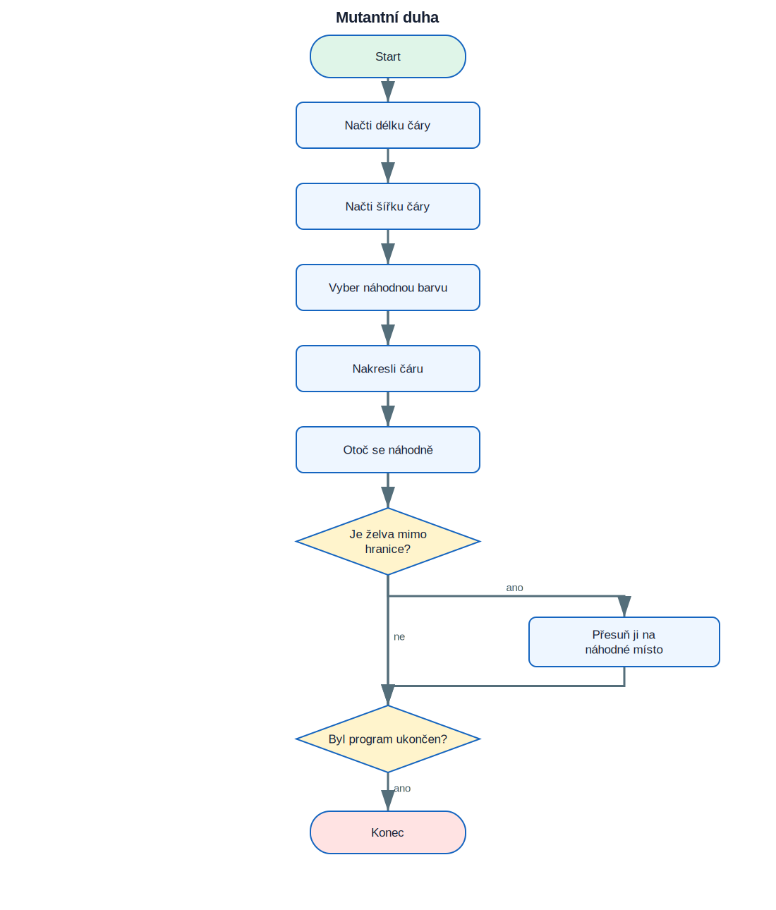

# 17. Projekt Mutantní duha

<div class="lesson-meta">
<strong>Doporučený čas:</strong> 90–120 minut<br>
<strong>Výstup:</strong> Dokážeš analyzovat, sestavit a vysvětlit projekt **Mutantní duha**.
</div>

<div class="project-goal">
<strong>Výsledek projektu:</strong> Program kreslí barevné čáry v náhodných směrech. Uživatel předem zvolí délku a šířku čar. Když želva opustí vymezenou oblast, přesune se na náhodné místo.
</div>

## Analýza projektu

### Vstupy

- zvolená délka a šířka čáry.

### Zpracování

- funkce načítají délku a šířku
- barva se volí náhodně
- směr se mění po každé čáře
- souřadnice hlídají hranice kreslicí oblasti

### Výstupy

- textový nebo grafický výsledek projektu,
- průběžné informace potřebné pro uživatele.

## Logické schéma

{ .flowchart }

!!! info "Nejdříve schéma, potom kód"
    Ukaž ve schématu místo, kde se program rozhoduje, a část, která se opakuje.

## Stavba programu po krocích

### 1. Připrav prostředí a data

Urči moduly, seznamy, proměnné a počáteční hodnoty.

### 2. Vytvoř hlavní operaci

Napiš část, která provádí hlavní úkol projektu. U grafických projektů je to typicky funkce pro kreslení jednoho prvku.

### 3. Přidej rozhodování a opakování

Porovnej podmínky s logickým schématem. Každý rozhodovací bod ve schématu musí mít odpovídající podmínku v kódu.

### 4. Dokonči a otestuj program

Vyzkoušej běžné i krajní vstupy. U nekonečných grafických programů se program ukončuje zavřením okna nebo přerušením běhu.

## Kompletní kód

```python title="mutantni_duha.py" linenums="1"
import turtle as t
from random import randint

t.bgcolor("black")
t.speed("fastest")
t.hideturtle()
t.colormode(255)

def get_line_length():
    choice = input("Choose line length: long, medium, or short: ")
    if choice == "long":
        return 250
    if choice == "medium":
        return 100
    return 50

def get_line_width():
    choice = input("Choose line width: thick, medium, or thin: ")
    if choice == "thick":
        return 40
    if choice == "medium":
        return 25
    return 10

line_length = get_line_length()
line_width = get_line_width()

while True:
    t.pensize(line_width)
    t.pencolor(randint(0, 255), randint(0, 255), randint(0, 255))
    t.forward(line_length)
    t.right(randint(1, 360))

    x, y = t.position()
    if x > 300 or x < -300 or y > 300 or y < -300:
        t.penup()
        t.goto(randint(-300, 300), randint(-300, 300))
        t.pendown()
```

[Stáhnout soubor `mutantni_duha.py`](code/mutantni_duha.py){ .md-button .md-button--primary }

## Kontrola porozumění

- [ ] Dokážu vysvětlit vstupy a výstupy programu.
- [ ] Dokážu najít hlavní cyklus.
- [ ] Dokážu určit, které části kódu odpovídají rozhodovacím bodům ve schématu.
- [ ] Dokážu změnit jednu hodnotu a předem odhadnout důsledek.
